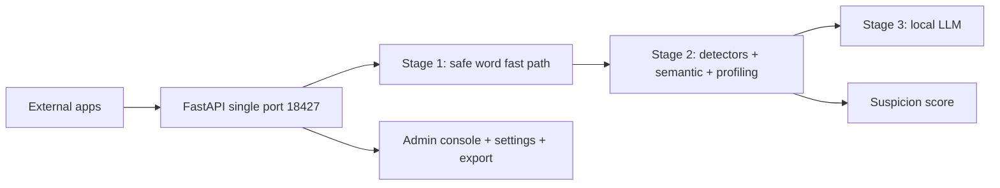

# General Moderation

A production-grade, multi-tenant content moderation service that pre-filters
content before human review. A three-stage pipeline combines fast-path rule
detection, semantic similarity, and user behavior profiling with a conditional
locally hosted LLM:

- **Stage 1** exits clearly safe content through a safe word fast path.
- **Stage 2** runs parallel rule detectors (Aho-Corasick, BK-tree, Metaphone,
  and multi-language packages), semantic similarity (SentenceTransformers +
  Faiss per category), and a 91-day user profiling window to compute a 0-100
  suspicion score.
- **Stage 3** invokes a local Qwen3.5-9B (GGUF, llama.cpp) model only when the
  per-app trigger policy fires, keeping the LLM on under 5% of traffic.

## Performance Targets

| Target | Value |
| :--- | :--- |
| Content handled without the LLM | 95%+, under 200 ms latency |
| LLM invocation | under 5% of traffic |
| Rule-based checks | sub-millisecond |
| Semantic query | under 50 ms |

## Monorepo Layout

| Directory | Contents |
| :--- | :--- |
| `backend/` | Python FastAPI moderation service |
| `frontend/` | React + TypeScript + Ant Design admin console |
| `docs/` | VitePress documentation |
| `deployment/` | systemd, FRP, logrotate, Docker, nginx configs |
| `scripts/` | Build, test, deploy, format, and secret scripts |

## Highlights

- 3-stage pipeline with an editable safe word fast path.
- 11 detector components across 26+ languages, every one backed by
  C/C++/Rust/WASM libraries.
- Semantic similarity with per-category Faiss indexes (political, violence,
  sexual, hate, pii, ads, other).
- User profiling with a 91-day rolling window and archived, linked cycle
  summaries (`next_cycle_id`) so long-term history never grows unbounded.
- Active learning: administrator feedback tunes weights and thresholds daily.
- Full runtime configurability through the admin UI — no restarts required.
- One-click full data export (databases, CSVs, logs, redacted config, semantic
  indexes).
- Custom words stored in SQLite (C implementation).
- All security-critical operations delegated to compiled libraries.

## Architecture



See `docs/architecture/` for full diagrams and `docs/` for the complete guide,
API reference, and algorithm documentation.

## Detector Coverage

| Detector | Languages | Key feature | Status |
| :--- | :--- | :--- | :--- |
| badwords | 26+ | Rust-based, fastest | Active |
| profanite | Universal | Anti-obfuscation | Active |
| glin-profanity | 25+ | Context-aware | Active |
| gangajal | All | WebAssembly | Active |
| PyProfane | Universal | Soundex-based | Active |
| sensitive-stop-words | Chinese | Submodule word lists (Aho-Corasick) | Active |
| safetext | 13 | Phrase detection | Guard-wired |
| sensitive-word-filter-cn | Chinese | Pinyin, symbols | Guard-wired |
| profanity-filter2 | Universal | Levenshtein automaton | Guard-wired |

`scheckbl` and `valx` are not wired (their documented APIs do not exist in the
installed versions).

## Quick Start

Dependencies are managed with **uv** (the modern, Rust-based Python toolchain).
Install it from <https://astral.sh/uv/>.

### One-command orchestration (recommended)

From the repository root:

```bash
npm install          # installs concurrently (root tooling)
npm run install:all  # uv sync (backend) + npm deps (frontend)
git submodule update --init  # fetch the sensitive-stop-words word lists
npm run generate:secrets     # generate secure *_KEY/_SECRET values in backend/.env
npm run build        # build the frontend once (required before start:prod)
npm run start:dev    # dev: backend (uvicorn :8080) + frontend (vite :5173)
npm run start:prod   # prod: serve everything on APP_PORT (frontend must be built)
```

Production runs on a **single port**: FastAPI serves the built frontend and
the whole API on `APP_HOST:APP_PORT` (default `0.0.0.0:18427`, set in
`backend/.env`). Start scripts never build the frontend; run `npm run build`
(or `npm run build:prod`) once before `npm run start:prod`.

Other root scripts: `npm run lint`, `npm run format`, `npm run build`,
`npm run docs:dev`, `npm run docs:build`, `npm run install:backend`.

### Manual backend

```bash
cd backend
uv sync              # create .venv and install all locked dependencies
uv run python run.py
```

### Optional semantic layer

The semantic similarity stage needs heavy optional dependencies (torch,
SentenceTransformers, Faiss). Install them with:

```bash
cd backend && uv sync --extra ai --extra semantic
```

Without them the stage reports itself unavailable and the pipeline skips it.

## Secret Generation

`npm run generate:secrets` scans `backend/.env` for every variable ending in
`_KEY` or `_SECRET` that is empty or set to `CHANGE_ME` and replaces it with a
cryptographically secure random value (48 characters, mixed case, digits, and
symbols). It is idempotent, never overwrites real values without confirmation,
and prints only masked values. Values can also be auto-generated on first
startup by the service itself.

## Model Auto-Download

On first startup, General Moderation automatically downloads the
Qwen3.5-9B-Q4_K_M.gguf model (~5.78 GB) into `backend/models/`. The download
runs in the background so the service starts immediately; the model is loaded
once it is available.

**For users in China:** the system probes connectivity and falls back in order:

1. `https://huggingface.co` (primary)
2. `https://hf-mirror.com` (primary mirror)
3. `https://www.modelscope.cn` (Alibaba-owned platform)
4. Manual download instructions if all endpoints fail

Downloads retry with exponential backoff (1s, 2s, 4s) and resume partial
transfers. The model unloads after `MODEL_IDLE_TIMEOUT_SECONDS` of inactivity
to free memory.

**To manually place the model:**

1. Download from:
   - Primary: <https://huggingface.co/bartowski/Qwen_Qwen3.5-9B-GGUF>
   - Mirror: <https://hf-mirror.com/bartowski/Qwen_Qwen3.5-9B-GGUF>
2. Place it at `backend/models/Qwen_Qwen3.5-9B-Q4_K_M.gguf`
3. Or set `MODEL_PATH=/path/to/model.gguf` in `.env`

## Administration

- **Dashboard**: live statistics, counters, and profiling data.
- **Word Bank**: add, edit, remove, import, and export custom words.
- **Settings**: edit every runtime parameter (weights, thresholds, toggles,
  LLM, logging, performance) without a restart; values persist in
  `settings.db` and apply immediately.
- **Export**: download a ZIP of all databases, CSV dumps, logs, a redacted
  configuration snapshot, and semantic indexes (rate-limited).
- **Feedback**: submit corrections; the daily auto-tuning batch adjusts weights
  and the trigger threshold.

## Performance Optimizations

| Optimization | Implementation | Benefit |
| :--- | :--- | :--- |
| Stage 1 fast path | Safe word list (C regex) | <1 ms exits for clean traffic |
| KV Cache Quantization | Q8_0 (`type_k`/`type_v`) | ~50% KV memory reduction |
| Flash Attention | Enabled | Reduced memory bandwidth |
| Memory Locking (mlock) | Enabled | Prevents OS swapping |
| Idle Unloading | 300s timeout | Frees model memory when idle |
| Result Cache | LRU + TTL (mmh3 key) | <50 ms for repeated requests |
| Parallel Detectors | ThreadPoolExecutor | Faster multi-package runs |
| CPU Offload | `run_in_threadpool` | Non-blocking async API |
| Worker Reduction | 3 gunicorn workers | Lower per-worker model memory |
| Conditional LLM | Suspicion scoring + trigger policy | LLM on <5% of traffic |
| Archive Summaries | 91-day cycle compaction | Bounded live storage |

## Documentation

The full guide is in the VitePress site under `docs/`, covering installation,
configuration, the 3-stage pipeline, archive strategy, algorithm
formulations, the API reference, and deployment. Run `npm run docs:dev` to
preview it locally.

## Testing

### Phase 1 (Complete)
- **1,000 core test cases** covering critical paths across detectors, engine,
  semantic similarity, user profiling, 91-day archive, auto-tuning, the LLM
  model, settings, security, export, and chaos resilience.
- **Speed**: runs across every available CPU core via pytest-xdist
  (`-n auto`, worker count derived from the machine at runtime — never
  hard-coded).
- **Report**: `backend/test_reports/index.html` (generated with
  `pytest --html`).
- Each test file contains at most 100 test cases; every test is isolated in
  its own temporary directory.

### Phase 2 (Current)
- **9,000 additional test cases** (10,000 total) across 92 generated files,
  expanding every module's dimension matrix: 26 languages, full text-length
  ranges, obfuscation/encoded/transliterated content, edit distances 1-3, all
  semantic categories, windows 1-365 days, user/app counts to 1,000, batch
  sizes to 100, and the full security/chaos fault and attack vectors.
- **100% uniqueness** — no Phase 2 case overlaps any Phase 1 case (verified by
  `backend/tests/tools/phase2_uniqueness_report.md`).
- **Golden-master generation**: the suite is emitted by
  `backend/tests/tools/phase2_generator.py`, which runs the real application
  to capture expected values, so the tests lock in observed behavior.
- **Speed**: like Phase 1, the suite is parallelized across all available
  cores. A session-scoped database template in `backend/tests/conftest.py`
  pre-seeds the SQLite files once per worker and copies them into each test's
  sandbox, so per-test fixture setup costs only file copies instead of schema
  creation and seeding.
- The full testing pipeline — discovery, worker distribution, fixture
  lifecycle, generation, and verification — is documented with diagrams in
  `docs/guide/testing.md`.

### Future Phases
- A full test universe of 25,000,000+ cases is documented in
  `backend/tests/*/README.md`.
- Each README contains the planned ID ranges, the dimension matrix, current
  implementation status, and detailed instructions for adding new cases.
- Later phases expand coverage to every dimension combination (languages,
  volumes, thresholds, concurrency, obfuscation, and more).

### Run Tests
```bash
npm run test        # all backend tests, all available cores (-n auto)
npm run test:unit   # unit tests only (tests/unit)
npm run test:e2e    # E2E only (tests/e2e)
npm run test:integration  # integration tests only (tests/integration)
npm run test:phase2 # Phase 2 tests only (tests -k phase2)
npm run test:serial # full suite serial (deterministic CI debugging)
```

### Adding New Tests
- See the README in each test directory for step-by-step instructions.
- Follow the same patterns as Phase 1 (BaseTest, frozen clock, fixtures).
- Phase 2 cases are generated: edit `tests/tools/phase2_generator.py`, then
  run `uv run python tests/tools/phase2_generator.py` to regenerate the files
  and README tables.
- Update the corresponding README when adding new tests.
- Commit one file per commit with `[TEST-<TYPE>]` tags.

## License

[MIT](LICENSE)
