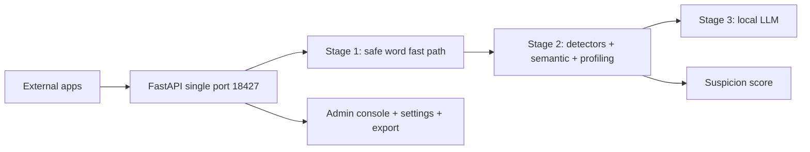

# General Moderation

A production-grade, multi-tenant content moderation service that pre-filters
content before human review. A three-stage pipeline combines fast-path rule
detection, semantic similarity, and user behavior profiling with a conditional
locally hosted LLM:

- **Stage 1** exits clearly safe content through a safe word fast path.
- **Stage 2** runs parallel rule detectors (Aho-Corasick, BK-tree, Metaphone,
  and multi-language packages), semantic similarity (SentenceTransformers +
  Faiss per category), and a 91-day user profiling window to compute a 0-100
  suspicion score.
- **Stage 3** invokes a local Qwen3.5-9B (GGUF, llama.cpp) model only when the
  per-app trigger policy fires, keeping the LLM on under 5% of traffic.

## Performance Targets

| Target | Value |
| :--- | :--- |
| Content handled without the LLM | 95%+, under 200 ms latency |
| LLM invocation | under 5% of traffic |
| Rule-based checks | sub-millisecond |
| Semantic query | under 50 ms |

## Monorepo Layout

| Directory | Contents |
| :--- | :--- |
| `backend/` | Python FastAPI moderation service |
| `frontend/` | React + TypeScript + Ant Design admin console |
| `docs/` | VitePress documentation |
| `deployment/` | systemd, FRP, logrotate, Docker, nginx configs |
| `scripts/` | Build, test, deploy, format, and secret scripts |

## Highlights

- 3-stage pipeline with an editable safe word fast path.
- 11 detector components across 26+ languages, every one backed by
  C/C++/Rust/WASM libraries.
- Semantic similarity with per-category Faiss indexes (political, violence,
  sexual, hate, pii, ads, other).
- User profiling with a 91-day rolling window and archived, linked cycle
  summaries (`next_cycle_id`) so long-term history never grows unbounded.
- Active learning: administrator feedback tunes weights and thresholds daily.
- Full runtime configurability through the admin UI — no restarts required.
- One-click full data export (databases, CSVs, logs, redacted config, semantic
  indexes).
- Custom words stored in SQLite (C implementation).
- All security-critical operations delegated to compiled libraries.

## Architecture



See `docs/architecture/` for full diagrams and `docs/` for the complete guide,
API reference, and algorithm documentation.

## Detector Coverage

| Detector | Languages | Key feature | Status |
| :--- | :--- | :--- | :--- |
| badwords | 26+ | Rust-based, fastest | Active |
| profanite | Universal | Anti-obfuscation | Active |
| glin-profanity | 25+ | Context-aware | Active |
| gangajal | All | WebAssembly | Active |
| PyProfane | Universal | Soundex-based | Active |
| sensitive-stop-words | Chinese | Submodule + 3 raw word lists (Rust Aho-Corasick) | Active |
| phrase-detector | Any | Severity-aware critical phrases | Active |
| safetext | 13 | Phrase detection | Guard-wired |
| sensitive-word-filter-cn | Chinese | Pinyin, symbols | Guard-wired |
| profanity-filter2 | Universal | Levenshtein automaton | Guard-wired |

`scheckbl` and `valx` are not wired (their documented APIs do not exist in the
installed versions).

## Quick Start

Dependencies are managed with **uv** (the modern, Rust-based Python toolchain).
Install it from <https://astral.sh/uv/>.

### One-command orchestration (recommended)

From the repository root:

```bash
npm install          # installs concurrently (root tooling)
npm run install:all  # uv sync (backend) + npm deps (frontend)
git submodule update --init  # fetch the Chinese sensitive-word lists
npm run generate:secrets     # generate secure *_KEY/_SECRET values in backend/.env
npm run seed         # seed critical phrases, semantic examples, and safe words (idempotent)
npm run build        # build the frontend once (required before start:prod)
npm run start:dev    # dev: backend (uvicorn :8080) + frontend (vite :5173)
npm run start:prod   # prod: serve everything on APP_PORT (frontend must be built)
```

### Seeding first-run data

`npm run seed` fills the data that a fresh deployment needs to detect
high-severity content out of the box:

- **Critical phrases** — a curated starter set of high-severity phrases
  (violence, hate speech, political extremism, child safety) from
  `backend/seed_data/critical_phrases.json`, stored in
  `data/critical_phrases.db` and matched by the severity-aware
  `phrase_detector`.
- **Semantic examples** — the default per-category example texts are persisted
  into the semantic indexes (only when the optional semantic dependencies are
  installed and a category index is empty).
- **Safe words** — a minimal starter safe-word list, only when
  `data/safe_words.txt` is empty.

The seed is **idempotent** and **never overwrites operator edits**; it is not
run automatically at startup. Extend the phrase list through the admin API
(`POST /admin/phrases`) or by editing the seed JSON.

Production runs on a **single port**: FastAPI serves the built frontend and
the whole API on `APP_HOST:APP_PORT` (default `0.0.0.0:18427`, set in
`backend/.env`). Start scripts never build the frontend; run `npm run build`
(or `npm run build:prod`) once before `npm run start:prod`.

Other root scripts: `npm run lint`, `npm run format`, `npm run build`,
`npm run docs:dev`, `npm run docs:build`, `npm run install:backend`,
`npm run seed`.

### Manual backend

```bash
cd backend
uv sync              # create .venv and install all locked dependencies
uv run python run.py
```

### Optional semantic layer

The semantic similarity stage needs heavy optional dependencies (torch,
SentenceTransformers, Faiss). Install them with:

```bash
cd backend && uv sync --extra ai --extra semantic
```

Without them the stage reports itself unavailable and the pipeline skips it.

## Secret Generation

`npm run generate:secrets` scans `backend/.env` for every variable ending in
`_KEY` or `_SECRET` that is empty or set to `CHANGE_ME` and replaces it with a
cryptographically secure random value (48 characters, mixed case, digits, and
symbols). It is idempotent, never overwrites real values without confirmation,
and prints only masked values. Values can also be auto-generated on first
startup by the service itself.

## Model Auto-Download

On first startup, General Moderation automatically downloads the
Qwen3.5-9B-Q4_K_M.gguf model (~5.78 GB) into `backend/models/`. The download
runs in the background so the service starts immediately; the model is loaded
once it is available.

**For users in China:** the system probes connectivity and falls back in order:

1. `https://huggingface.co` (primary)
2. `https://hf-mirror.com` (primary mirror)
3. `https://www.modelscope.cn` (Alibaba-owned platform)
4. Manual download instructions if all endpoints fail

Downloads retry with exponential backoff (1s, 2s, 4s) and resume partial
transfers. The model unloads after `MODEL_IDLE_TIMEOUT_SECONDS` of inactivity
to free memory.

**To manually place the model:**

1. Download from:
   - Primary: <https://huggingface.co/bartowski/Qwen_Qwen3.5-9B-GGUF>
   - Mirror: <https://hf-mirror.com/bartowski/Qwen_Qwen3.5-9B-GGUF>
2. Place it at `backend/models/Qwen_Qwen3.5-9B-Q4_K_M.gguf`
3. Or set `MODEL_PATH=/path/to/model.gguf` in `.env`

## Administration

- **Dashboard**: live statistics, counters, and profiling data.
- **Word Bank**: add, edit, remove, import, and export custom words.
- **Critical Phrases**: manage the severity-aware high-severity phrase list
  (`/admin/phrases`), which hard-blocks matches at or above
  `SEVERITY_HARD_BLOCK_THRESHOLD`.
- **Settings**: edit every runtime parameter (weights, thresholds, toggles,
  LLM, logging, performance) without a restart; values persist in
  `settings.db` and apply immediately. Detector toggles and per-app policies
  invalidate the result cache so changes take effect right away.
- **Export**: download a ZIP of all databases, CSV dumps, logs, a redacted
  configuration snapshot, and semantic indexes (rate-limited).
- **Feedback**: submit corrections; the daily auto-tuning batch adjusts weights
  and the trigger threshold.

## Performance Optimizations

| Optimization | Implementation | Benefit |
| :--- | :--- | :--- |
| Stage 1 fast path | Safe word list (C regex) | <1 ms exits for clean traffic |
| KV Cache Quantization | Q8_0 (`type_k`/`type_v`) | ~50% KV memory reduction |
| Flash Attention | Enabled | Reduced memory bandwidth |
| Memory Locking (mlock) | Enabled | Prevents OS swapping |
| Idle Unloading | 300s timeout | Frees model memory when idle |
| Result Cache | LRU + TTL (mmh3 key) | <50 ms for repeated requests |
| Parallel Detectors | ThreadPoolExecutor | Faster multi-package runs |
| CPU Offload | `run_in_threadpool` | Non-blocking async API |
| Worker Reduction | 3 gunicorn workers | Lower per-worker model memory |
| Conditional LLM | Suspicion scoring + trigger policy | LLM on <5% of traffic |
| Archive Summaries | 91-day cycle compaction | Bounded live storage |

## Documentation

The full guide is in the VitePress site under `docs/`, covering installation,
configuration, the 3-stage pipeline, archive strategy, algorithm
formulations, the API reference, and deployment. Run `npm run docs:dev` to
preview it locally.

## Testing

The test suite is a deterministic, fully parallel, self-generating system.
It grows through **phases**: a hand-written core that locks in the critical
paths, followed by generated golden-master suites that sweep every module's
dimension matrix. Once all planned phases are delivered, the application
encompasses **on the order of tens of millions of test cases** — the full
combinatorial universe of languages, text lengths, content classes, edit
distances, volumes, thresholds, concurrency levels, fault types, and attack
vectors is documented per module under `backend/tests/`.

The suite is engineered to be fast, not just large:

- **Every core, dynamically.** Tests run with pytest-xdist across all
  available CPU cores; the worker count is derived from the machine at
  runtime, never hard-coded.
- **Pre-seeded databases.** A session-scoped template builds the SQLite
  schema and seed data once per worker; each test copies those files into its
  own sandbox instead of recreating them, so per-test setup is file copies
  rather than schema construction.
- **Isolated.** Every test gets a private temporary directory and its own
  database copies; nothing can leak across tests.
- **Golden-master generation.** The generated suites are emitted by
  `backend/tests/tools/phase2_generator.py`, which runs the real application
  to capture expected values and freezes them as regression expectations.
  Regenerating is a safe, idempotent operation that also refreshes the
  per-module documentation and the uniqueness report.
- **Machine-checked.** Collection asserts an exact expected test count,
  generation emits a uniqueness report proving zero overlap with earlier
  phases, and every file passes the same `ruff` lint and format gates as
  production code.

The full pipeline — discovery, parametrization, worker distribution, fixture
lifecycle, generation, and verification — is documented with diagrams in
`docs/guide/testing.md`.

### Run Tests

```bash
npm run test        # all backend tests, all available cores (-n auto)
npm run test:unit   # unit tests only (tests/unit)
npm run test:integration  # integration tests only (tests/integration)
npm run test:e2e    # E2E only (tests/e2e)
npm run test:phase2 # generated golden-master tests only (tests -k phase2)
npm run test:serial # full suite serial (deterministic CI debugging)
```

A single test file can also be run directly, e.g.
`cd backend && uv run python -m pytest tests/unit/detectors -v`.

### Adding New Tests

1. Pick the module and phase from its README under `backend/tests/` — each
   one documents its dimension matrix, planned identifier ranges, and status.
2. **Hand-written core cases** follow the established pattern: extend the
   `BaseTest` helper, use the frozen clock and the shared fixtures from
   `backend/tests/conftest.py`, and keep every test isolated in its own
   temporary directory.
3. **Generated golden-master cases** are data entry: add rows to a module's
   dimension matrix in `backend/tests/tools/phase2_generator.py`, then run
   `cd backend && uv run python tests/tools/phase2_generator.py` to emit the
   new test files, refresh every module README, and regenerate the uniqueness
   report.
4. Verify with `ruff check`, `ruff format`, and the relevant test slice.
5. Update the corresponding README.
6. Commit **one file per commit** with `[TEST-<TYPE>]` tags.

### Report

`backend/test_reports/index.html` is generated with `pytest --html` and
contains the full pass/fail history of the suite.

## Credits

This project builds on open-source work. The Chinese sensitive-word lists are
consumed as **raw word data** through this service's own matching algorithms
(Aho-Corasick, BK-tree, Bloom); the subrepos do not ship Python bindings, so
no code from them runs here.

| Source | Repository | Used for |
| :--- | :--- | :--- |
| sensitive-stop-words | [fwwdn/sensitive-stop-words](https://github.com/fwwdn/sensitive-stop-words) | Per-category Chinese blocking lists (political, porn, gun, ad, url) |
| sensitive | [importcjj/sensitive](https://github.com/importcjj/sensitive) | `dict/dict.txt` — Chinese sensitive-word list |
| sensitive-lexicon | [konsheng/Sensitive-lexicon](https://github.com/konsheng/Sensitive-lexicon) | `Vocabulary/` — category word lists (political, porn, gun, URLs, etc.) |
| sensitive-word-data | [houbb/sensitive-word-data](https://github.com/houbb/sensitive-word-data) | `sensitive_word_dict.txt` — Chinese sensitive-word dictionary |

All subrepos live under `backend/data/` and are fetched with
`git submodule update --init`.

The detector packages, algorithms, and the rest of the dependencies used by
this project are credited on the [Credits page](docs/guide/credits.md) of the
documentation site.

## License

[MIT](LICENSE)
