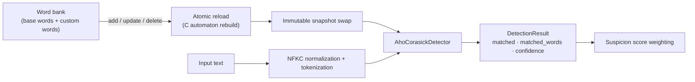
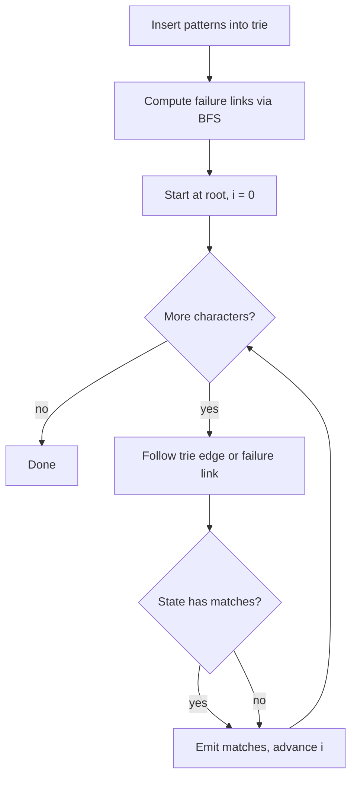

# Aho-Corasick

The Aho-Corasick algorithm builds a finite automaton over a dictionary of
sensitive words and scans the input text once, reporting every dictionary word
that occurs. It is the exact-matching workhorse of Level 2 detection and is
implemented by native engines: the Rust `ahocorasick-rs` library for the
Chinese sensitive-word lists (fastest scan path) and the C `pyahocorasick`
library for the word bank.

## Mathematical Formulation

Given a set of patterns \(P = \{p_1, \ldots, p_m\}\) with total length
\(m = \sum |p_i|\) and a text \(T\) of length \(n\), the algorithm constructs a
trie with failure links and then walks the text character by character. Every
state in the trie is annotated with the set of patterns that end at that
state. During the scan, a match is emitted whenever the current state has a
non-empty match set or any of its failure-link ancestors does.

\[
\text{matches}(T) = \{ (i, p) \mid p \in P,\ T[i - |p| + 1 : i + 1] = p \}
\]

## Complexity

- **Build**: \(O(m)\) time and \(O(m \cdot \Sigma)\) space, where \(\Sigma\)
  is the alphabet size.
- **Search**: \(O(n + z)\), where \(z\) is the number of emitted matches.

## Integration in General Moderation

Aho-Corasick backs two detectors:

1. **Sensitive-stop-words detector (priority 0)** — compiles the merged
   Chinese word lists (~110k terms from the `backend/data/` subrepos) with the
   Rust `ahocorasick-rs` engine (C `pyahocorasick` fallback), scans only CJK
   text, and hard-blocks on a match. The Python layer is a thin one-call
   adapter (`find_matches_as_strings`).
2. **AhoCorasickDetector (priority 3)** — scans the live word bank snapshot:



- **Language** — the word-bank detector is language-agnostic (`any`);
  dictionary entries are normalized and lowercased on write, and input is
  NFKC-folded before scanning, so full-width and decomposed Unicode variants
  are caught. The sensitive-stop-words detector is CJK-gated.
- **Word-boundary guard** — base dictionary words are only honored at ASCII
  word boundaries so noisy package dictionaries (e.g. `ass`) do not fire
  inside innocent words such as `class` or `grass`. Administrator-curated
  custom words keep full substring semantics.
- **Blocking semantics** — exact matches are decisive (blocking) with full
  confidence; the primary reason string names the matching engine.
- **Deduplication** — repeated dictionary words in one message are reported
  once; multiple distinct words are all reported.
- **Rebuild atomicity** — every word-bank mutation rebuilds the automaton off
  the hot path and swaps an immutable snapshot, so concurrent readers never
  observe a half-built structure.
- **Native core** — the automaton and scan run in Rust (`ahocorasick-rs`) or C
  (`pyahocorasick`); the detector wrappers are pure orchestration.

## Flowchart



## Pseudocode

```text
build_automaton(patterns):
    root = new trie node
    for pattern in patterns:
        node = root
        for char in pattern:
            node = node.children[char]
        node.outputs.add(pattern)
    queue = []
    for child in root.children:
        child.failure = root
        queue.push(child)
    while queue not empty:
        node = queue.pop()
        for (char, child) in node.children:
            failure = node.failure
            while failure != root and char not in failure.children:
                failure = failure.failure
            child.failure = failure.children[char] if char in failure.children else root
            child.outputs += child.failure.outputs
            queue.push(child)
    return root

scan(text, root):
    node = root
    for i, char in enumerate(text):
        while node != root and char not in node.children:
            node = node.failure
        node = node.children[char] if char in node.children else root
        for pattern in node.outputs:
            report(i, pattern)
```

## References

- Aho, A. V. and Corasick, M. J., "Efficient String Matching: An Aid to
  Bibliographic Search," Communications of the ACM, 1975.
- `ahocorasick-rs` — https://github.com/G-Research/ahocorasick_rs (Rust)
- `pyahocorasick` — https://github.com/WojciechMula/pyahocorasick
