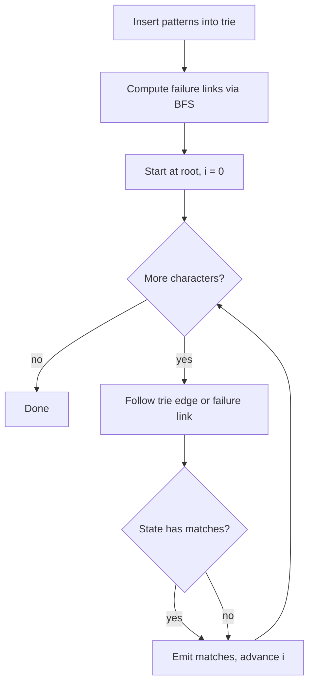

# Aho-Corasick

The Aho-Corasick algorithm builds a finite automaton over a dictionary of
sensitive words and scans the input text once, reporting every dictionary word
that occurs. It is the exact-matching workhorse of Level 2 detection and is
implemented by the C library `pyahocorasick`.

## Mathematical Formulation

Given a set of patterns \(P = \{p_1, \ldots, p_m\}\) with total length
\(m = \sum |p_i|\) and a text \(T\) of length \(n\), the algorithm constructs a
trie with failure links and then walks the text character by character. Every
state in the trie is annotated with the set of patterns that end at that
state. During the scan, a match is emitted whenever the current state has a
non-empty match set or any of its failure-link ancestors does.

\[
\text{matches}(T) = \{ (i, p) \mid p \in P,\ T[i - |p| + 1 : i + 1] = p \}
\]

## Complexity

- **Build**: \(O(m)\) time and \(O(m \cdot \Sigma)\) space, where \(\Sigma\)
  is the alphabet size.
- **Search**: \(O(n + z)\), where \(z\) is the number of emitted matches.

## Flowchart



## Pseudocode

```text
build_automaton(patterns):
    root = new trie node
    for pattern in patterns:
        node = root
        for char in pattern:
            node = node.children[char]
        node.outputs.add(pattern)
    queue = []
    for child in root.children:
        child.failure = root
        queue.push(child)
    while queue not empty:
        node = queue.pop()
        for (char, child) in node.children:
            failure = node.failure
            while failure != root and char not in failure.children:
                failure = failure.failure
            child.failure = failure.children[char] if char in failure.children else root
            child.outputs += child.failure.outputs
            queue.push(child)
    return root

scan(text, root):
    node = root
    for i, char in enumerate(text):
        while node != root and char not in node.children:
            node = node.failure
        node = node.children[char] if char in node.children else root
        for pattern in node.outputs:
            report(i, pattern)
```

## References

- Aho, A. V. and Corasick, M. J., "Efficient String Matching: An Aid to
  Bibliographic Search," Communications of the ACM, 1975.
- `pyahocorasick` — https://github.com/WojciechMula/pyahocorasick
