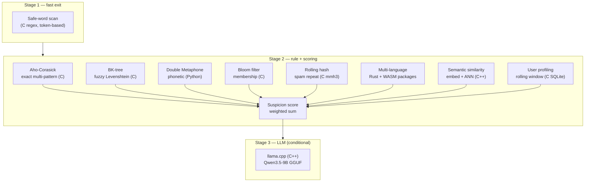

# Algorithms

The service relies on a small set of well-understood algorithms, each
documented here with its mathematical formulation, complexity analysis, its
**native implementation in this project**, a flowchart, and pseudocode.

## The Algorithm Map

Each algorithm occupies a precise role in the three-stage pipeline, and each
hot-path implementation is delegated to a compiled engine rather than
executed in Python.

## Algorithm Catalog

| Algorithm | Role | Native backing | Complexity |
| :--- | :--- | :--- | :--- |
| [Aho-Corasick](/algorithms/aho-corasick) | Exact multi-pattern matching | `pyahocorasick` (C) | O(n + m + z) build/search |
| [BK-tree](/algorithms/bk-tree) | Fuzzy matching, bounded Levenshtein | `python-Levenshtein` (C) for distance, tree in Python | O(log n) typical query |
| [Double Metaphone](/algorithms/metaphone) | Phonetic variant matching | pure Python encoding | O(n) |
| [Bloom filter](/algorithms/suspicion-score) | Constant-time non-membership | `pybloom-live` + `mmh3` (C) | O(k) hash probes |
| [Rolling hash](/algorithms/user-profiling) | Repeated-content detection | `mmh3` (C) | O(1) per token |
| [Semantic Similarity](/algorithms/semantic-similarity) | Paraphrase detection | SentenceTransformer + Faiss (C++) | O(n) encode, O(log N) search |
| [Suspicion Score](/algorithms/suspicion-score) | Weighted signal aggregation | glue arithmetic (bounded) | O(d + c) |
| [User Profiling](/algorithms/user-profiling) | Rolling window with cycle summaries | SQLite (C) | O(w + s) per read |
| [Weight Tuning](/algorithms/weight-tuning) | Precision-driven daily adjustments | glue arithmetic | O(f + w) |

## Shared Design Principles

Every algorithm in the pipeline obeys the same contracts:

- **Determinism** — the same input always produces the same output; all
  indexing and scoring is order-stable.
- **Boundable cost** — each detector is linear or logarithmic in the input,
  and the detector set runs in parallel, so stage-two latency is the slowest
  single detector, not the sum.
- **Graceful degradation** — a missing optional dependency (Faiss, the LLM, a
  language package) marks that stage unavailable and the pipeline skips it
  without error.
- **Native hot paths** — matching, hashing, validation, and serialization are
  delegated to C/C++/Rust/WASM; Python only orchestrates and sums a bounded
  number of signals.

## Related Documentation

- [3-Stage Pipeline](/architecture/pipeline)
- [Performance Engineering](/architecture/performance)
