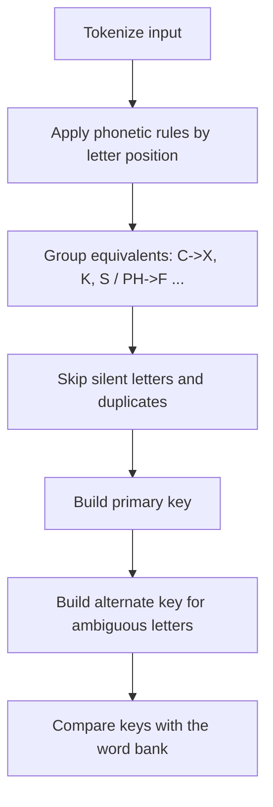

# Double Metaphone

Double Metaphone encodes a word into one or two phonetic keys so that words
that sound alike — but are spelled differently — can be matched. It catches
misspellings and phonetic variants that exact matchers miss.

## Mathematical Formulation

The algorithm applies a sequence of consonant and vowel transformations,
grouping phonetically equivalent letters. Each word maps to a primary key
\(k_1\) and an alternate key \(k_2\):

\[
k_1 = \text{encode}(w),\qquad k_2 = \text{encode}_\text{alternate}(w)
\]

Two words are phonetic matches when any of their keys are equal:

\[
\text{match}(w_1, w_2) \iff k_1(w_1) \in \{k_1(w_2), k_2(w_2)\}
\]

## Complexity

- **Time**: \(O(n)\) per word, where \(n\) is the word length.
- **Space**: \(O(1)\) (fixed-length key buffer).

## Flowchart



## Pseudocode

```text
function double_metaphone(word):
    key1 = ""
    key2 = ""
    i = 0
    while i < len(word):
        letter = word[i]
        next = word[i + 1]
        if letter in {C, K, Q} and next == "H":
            key1 += "K"; i += 2
        elif letter == "P" and next == "H":
            key1 += "F"; i += 2
        elif letter in {"A", "E", "I", "O", "U", "Y"}:
            if i == 0: key1 += "A"
            i += 1
        else:
            key1 += map(letter); i += 1
        # alternate key appended when the letter has two phonetic values
    return key1, key2
```

## References

- Philips, L., "Hanging on the Metaphone," Computer Language, 1990.
- `metaphone` — https://pypi.org/project/Metaphone/
