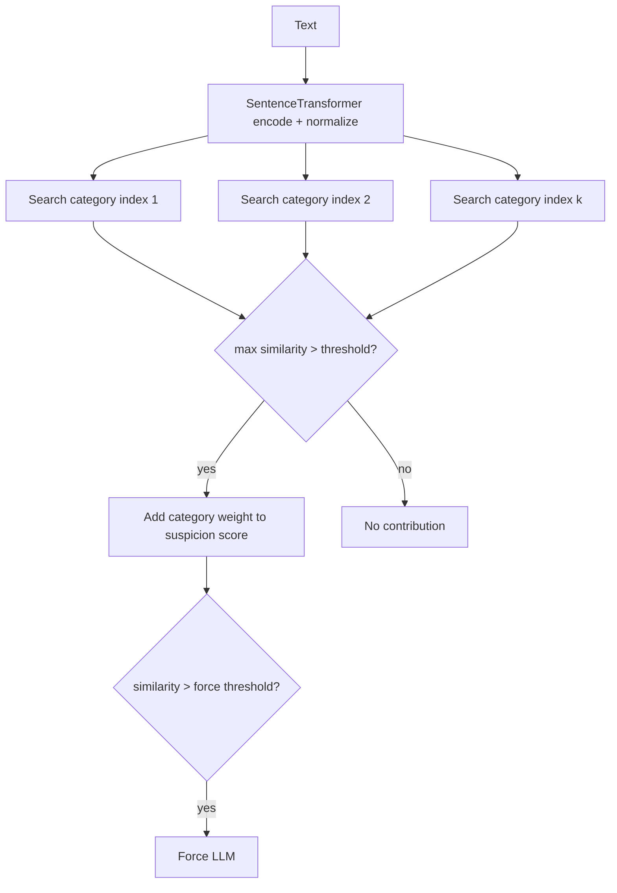

# Semantic Similarity

Semantic similarity catches paraphrased or rewritten sensitive content that
bypasses keyword filters. The text is embedded with a multilingual
SentenceTransformer and compared against per-category Faiss indexes of known
examples.

## Mathematical Formulation

Given a text \(t\), the model produces a vector
\(v_t = \text{model}(t) \in \mathbb{R}^{384}\), L2-normalized so the inner
product equals cosine similarity. For each category \(c\) with an index
\(I_c\) of normalized example vectors:

\[
s_c = \max_{v \in I_c} \frac{v_t \cdot v}{\|v_t\| \cdot \|v\|}
     = \max_{v \in I_c} \langle \hat{v}_t, \hat{v} \rangle
\]

The category contributes its weight to the suspicion score when
\(s_c > \theta_c\) (the `SEMANTIC_SIMILARITY_THRESHOLD`), and forces the LLM
when \(s_c > \theta_\text{force}\) (the
`SEMANTIC_FORCE_LLM_THRESHOLD`).

## Complexity

- **Encoding**: \(O(n)\) transformer passes over the text.
- **Search**: \(O(\log N)\) with an IVF-PQ index, where \(N\) is the number
  of examples; the implementation uses an exact `IndexFlatIP` over
  normalized vectors, which is \(O(N)\) and identical in output.
- **Storage**: one index file plus one JSON source-text file per category.

## Flowchart



## Pseudocode

```text
function query(text):
    v = normalize(model.encode(text))
    for category in categories:
        scores = index[category].search(v, top_k)
        similarity[category] = max(scores)
    return similarity

function add(category, text):
    vectors[category].append(normalize(model.encode([text])))
    rebuild_and_persist(index[category], texts[category])
```

## References

- Reimers, N. and Gurevych, I., "Sentence-BERT: Sentence Embeddings using
  Siamese BERT-Networks," EMNLP 2019.
- Johnson, J., Douze, M., and Jegou, H., "Billion-scale Similarity Search with
  GPUs," IEEE Transactions on Big Data, 2019.
