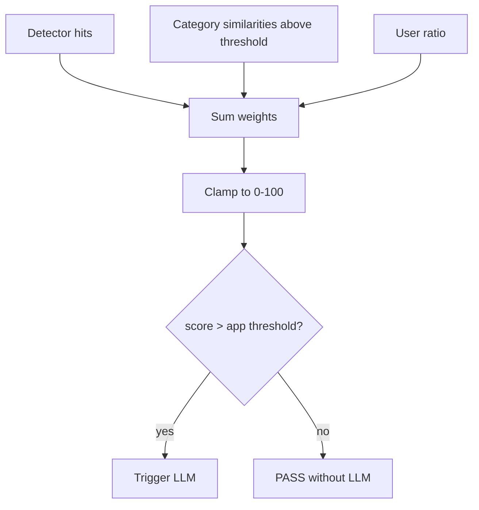

# Suspicion Score

The suspicion score aggregates every Stage 2 signal into a single 0-100
number that drives the Stage 3 trigger decision.

## Mathematical Formulation

\[
\text{score} =
\sum_{d \in D} \text{hit}_d \cdot w_d
+ \sum_{c \in C} \mathbb{1}[s_c > \theta_c] \cdot w_c
+ \text{ratio}_u \cdot w_u
\]

clamped to \([0, 100]\), where:

- \(D\) is the set of detectors that matched, each weighted by
  `WEIGHT_DETECTOR_*`.
- \(C\) is the set of semantic categories; a category contributes its
  `WEIGHT_SEMANTIC_*` weight when its similarity exceeds the threshold.
- \(\text{ratio}_u\) is the user bad-content ratio from the profiling layer,
  weighted by `WEIGHT_USER`.

## Complexity

- **Time**: \(O(|D| + |C|)\) per request, independent of text length.
- **Space**: \(O(1)\).

## Flowchart



## Pseudocode

```text
function score(detector_hits, similarities, user_ratio):
    raw = 0
    for detector in detector_hits:
        raw += weight(detector)
    for category, similarity in similarities:
        if similarity > similarity_threshold:
            raw += weight(category)
    raw += user_ratio * weight_user
    return clamp(raw, 0, 100)
```

## Trigger Policy

The LLM trigger uses the per-application policy from `config.db`:

- `score_threshold`: suspicion score that alone triggers the LLM.
- `semantic_boost`: similarity above `SEMANTIC_FORCE_LLM_THRESHOLD`.
- `user_ratio_boost`: user ratio above `USER_RATIO_THRESHOLD`.
- `logic_type`: `"or"` (any) or `"and"` (all).

## Weight Tuning

Weights are adjusted daily by the feedback batch (see [Weight
Tuning](/algorithms/weight-tuning)), and every weight is clamped to the
5-50 range.
