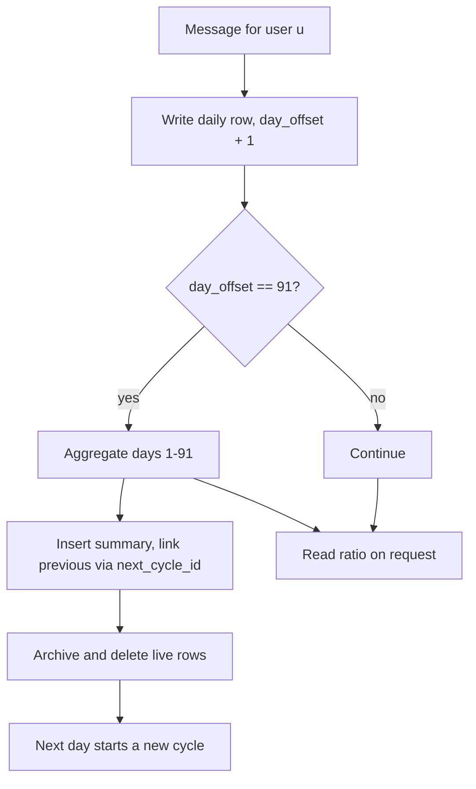

# User Profiling

User profiling identifies users who consistently send problematic content and
boosts their suspicion score accordingly. Data is organized as a chain of
91-day cycles with bounded live storage (see [Archive Strategy](/architecture/archive-strategy)
for the full data model and algorithm).

## Mathematical Formulation

For a user \(u\), the bad-content ratio combines the live window and all
summaries:

\[
\text{ratio}_u =
\frac{\sum \text{flagged}_u + \sum \text{blocked}_u}
     {\sum \text{total}_u}
\]

where the sums run over the current cycle's daily rows and every archived
summary. The ratio is used directly as the `ratio_u` term of the [Suspicion
Score](/algorithms/suspicion-score). When the ratio exceeds
`USER_RATIO_THRESHOLD` and `user_ratio_boost` is enabled, the LLM is forced.

## Complexity

- **Write**: \(O(1)\) per request.
- **Archive**: \(O(\text{rows in the cycle})\) every 91 days.
- **Read**: \(O(91 + s)\), where \(s\) is the number of summaries.

## Flowchart



## Pseudocode

```text
function record(app, user, flags):
    today = today()
    day_offset = (today - cycle_start(app, user)) + 1
    if day_offset > 91:
        write_row(app, user, 91, today, flags)     # include today in summary
        archive_cycle(app, user, today)            # aggregate + link + delete
        return
    write_row(app, user, day_offset, today, flags)
    if day_offset == 91:
        archive_cycle(app, user, today)

function ratio(app, user):
    live = sum(daily rows for app, user)
    history = sum(summaries for app, user)
    return (flagged + blocked) / total            # 0 when total == 0
```

## References

- The rolling-window design with archived period summaries mirrors common
  time-series compaction patterns used in metrics databases such as
  Prometheus downsampling.
