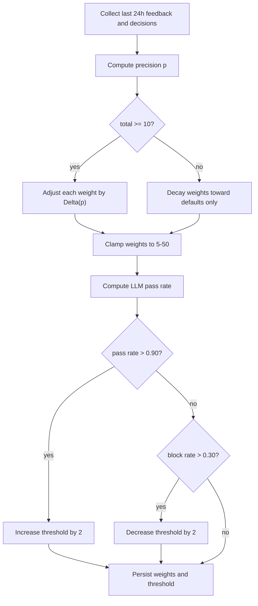

# Weight Tuning

The daily batch converts administrator corrections into better weights and a
better LLM trigger threshold, steering the service toward the
`AI_TARGET_PERCENTAGE` of traffic handled by the LLM.

## Precision-Driven Weight Adjustment

Feedback from the last 24 hours is aggregated per decision. The batch
precision is

\[
p = \frac{\text{correct}}{\text{total}}
\]

Each weight moves by a small step toward the precision signal, and the result
is clamped to the 5-50 range:

\[
w' = \text{clamp}\left(\text{default} + (w - \text{default}) \cdot \delta + \Delta(p),\ 5,\ 50\right)
\]

where \(\delta = 2^{-t / \tau}\) is the exponential decay with half-life
\(\tau = \text{WEIGHT\_DECAY\_HALF\_LIFE\_DAYS}\) and

\[
\Delta(p) = \begin{cases}
+1 & p > 0.6 \\
-1 & p < 0.4 \\
0  & \text{otherwise}
\end{cases}
\]

## Threshold Tuning

The LLM pass rate over the last 24 hours moves the default suspicion
threshold:

- If the LLM passes more than 90% of what it sees, the threshold increases by
  2 (less AI).
- If the LLM blocks more than 30%, the threshold decreases by 2 (more AI).

The target is for the LLM to handle approximately `AI_TARGET_PERCENTAGE` of
traffic.

## Complexity

- **Time**: \(O(f + w)\), where \(f\) is the feedback row count and \(w\) the
  weight count.
- **Space**: \(O(f + w)\).

## Flowchart



## Pseudocode

```text
function run_batch():
    feedback = rows since 24h ago
    decisions = rows since 24h ago
    precision = correct(feedback) / len(feedback)
    for key in weight_keys:
        delta = decay(last_tuned)
        step = +1 if precision > 0.6 else -1 if precision < 0.4 else 0
        weights[key] = clamp(default + (current - default) * delta + step, 5, 50)
    save(weights)
    pass_rate = passes(decisions) / ai(decisions)
    if pass_rate > 0.90: threshold += 2
    elif pass_rate < 0.70: threshold -= 2
    save_default_threshold(threshold)
```

## References

- Exponential decay follows the standard half-life model
  \(x(t) = x_0 \cdot 2^{-t/\tau}\).
