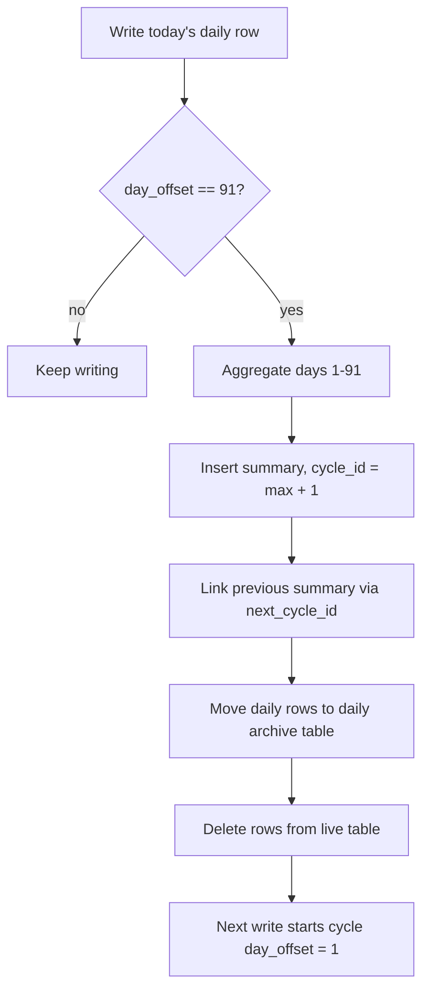

# Archive Strategy: 91-Day Rolling Window With Linked Summaries

User profiling keeps a bounded amount of raw data in the live database while
preserving long-term history forever. Each user's history is a **chain of
91-day cycles**. The live `users.db` holds only the current cycle's raw daily
rows; every completed cycle is compressed into a single summary row in
`archive.db`, and each summary points to the next one through
`next_cycle_id` — a linked list of periods.

## The Cycle

A cycle runs 91 days. During the cycle, each day writes a row into
`user_daily_stats` with a `day_offset` of 1 through 90.

On **day 91**:

1. The day-91 daily row is written as usual (`day_offset = 91`).
2. All rows from day 1 through day 91 are aggregated into one summary record.
3. The summary is inserted into `user_summaries` with `next_cycle_id = NULL`.
4. The previous cycle's summary is updated to point at the new one.
5. The daily rows are moved to the daily archive table and deleted from the
   live table.
6. The next calendar day becomes `day_offset = 1` of the next cycle.

## Example Timeline

```text
Day 1 ......... Day 90   Day 91              Day 92 ....... Day 181   Day 182
|-- cycle 1 --|  daily   archive day 91,     |-- cycle 2 --|  daily    archive cycle 2,
|  daily rows |  rows    summarize 1-91,     |  daily rows |  rows     link summary 1 -> 2,
|  (1-90)     |         clear live table                     clear live table
```

Cycle 2's summary stores `start_day = day 92`, `end_day = day 182` and sets
`next_cycle_id` on cycle 1's summary to `2`.

## Data Model

Live table `user_daily_stats`:

| Column | Type | Description |
| :--- | :--- | :--- |
| `id` | INTEGER PRIMARY KEY | unique identifier |
| `app_name` | TEXT | the application name |
| `user_id` | TEXT | the user identifier |
| `day_offset` | INTEGER | 1-91 within the current cycle |
| `total_msgs` | INTEGER | messages sent this day |
| `flagged_msgs` | INTEGER | messages flagged as suspicious |
| `blocked_msgs` | INTEGER | messages blocked by the LLM |
| `reviewed_msgs` | INTEGER | messages reviewed by an admin |
| `date` | DATE | the calendar date |

Archive table `user_summaries`:

| Column | Type | Description |
| :--- | :--- | :--- |
| `id` | INTEGER PRIMARY KEY | unique identifier |
| `app_name` | TEXT | the application name |
| `user_id` | TEXT | the user identifier |
| `cycle_id` | INTEGER | 1-based cycle number |
| `start_day` | DATE | first day of the cycle |
| `end_day` | DATE | last day of the cycle |
| `total_msgs` | INTEGER | aggregated total |
| `flagged_msgs` | INTEGER | aggregated flagged |
| `blocked_msgs` | INTEGER | aggregated blocked |
| `reviewed_msgs` | INTEGER | aggregated reviewed |
| `next_cycle_id` | INTEGER | the following summary, or NULL |
| `created_at` | DATETIME | summary creation time |

## Archive Algorithm



### Pseudocode

```text
function archive_cycle(app, user):
    rows = SELECT * FROM user_daily_stats WHERE app = ? AND user = ?
    summary = aggregate(rows)          # includes day 91's row
    cycle_id = MAX(cycle_id) + 1
    new_id = INSERT INTO user_summaries(summary, cycle_id, next_cycle_id = NULL)
    previous = newest summary except new_id
    UPDATE previous SET next_cycle_id = new_id
    INSERT archived daily rows INTO user_daily_archive
    DELETE FROM user_daily_stats WHERE app = ? AND user = ?
```

## Behavior After an Inactive Gap

If a user posts again after the cycle has expired (day offset above 91), the
stale cycle is closed on the next write: the new message is written as the
cycle's final day, included in the summary, and a fresh cycle begins on the
following write. No data is lost.

## Reading the User Profile

The bad-content ratio combines the live window and all summaries:

```sql
-- live window
SELECT SUM(total_msgs), SUM(flagged_msgs + blocked_msgs)
FROM user_daily_stats WHERE app_name = ? AND user_id = ?;

-- long-term history
SELECT SUM(total_msgs), SUM(flagged_msgs + blocked_msgs)
FROM user_summaries WHERE app_name = ? AND user_id = ?;
```

## Complexity and Storage

- **Write**: O(1) per request (single upsert).
- **Archive**: O(rows in the cycle) per 91 days per active user.
- **Read**: O(91 + number of summaries) per user.

The live table holds at most one window of raw rows per user; summaries grow
at one row per user per 91 days, which is negligible compared with retaining
every daily row forever.
