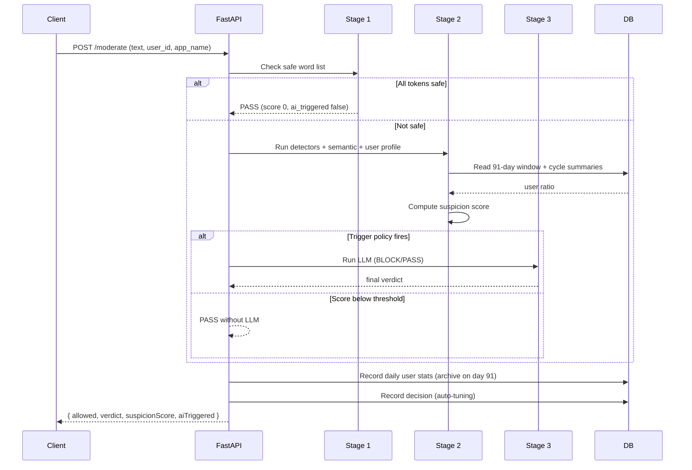
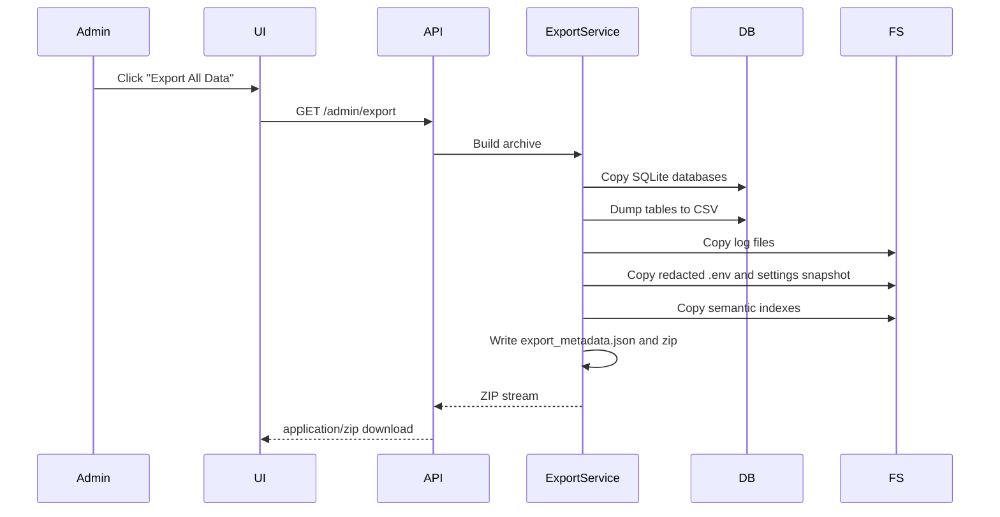
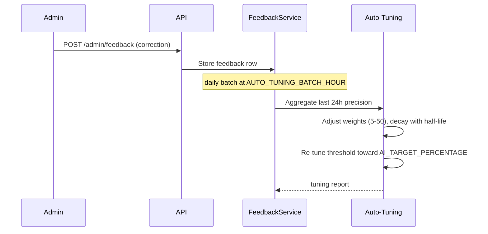
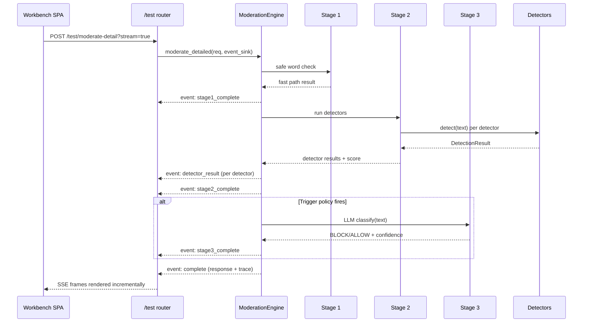

# Data Flow

## Request Flow

## Export Flow

## Feedback Flow

## Workbench Flow

The [Test Workbench](/guide/test-workbench) drives the same three-stage
pipeline but asks the engine for a full `PipelineTrace` and streams it live.
`moderate_detailed()` is an additive method over `moderate()`: it runs the
identical pipeline, records per-stage latencies, per-detector results, the
score breakdown, and the LLM prompt/reply, and — when given an `event_sink` —
emits one SSE event per completed stage.

The concurrent load test (`POST /test/load-test`) runs the same
`moderate_detailed()` path from an async generator, with a semaphore capping
in-flight users, and streams `progress` events plus a final `complete` event.
See the [Workbench API reference](/api/workbench) for the event schemas and the
[Test Workbench guide](/guide/test-workbench) for the full field-by-field
trace structure.
