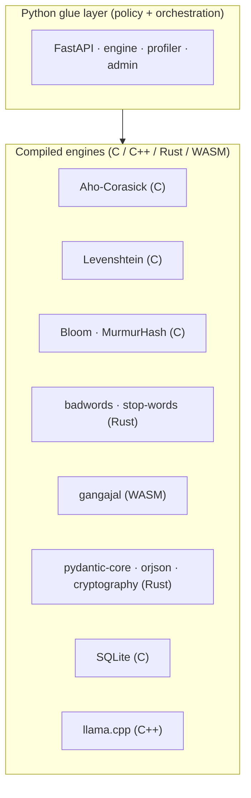
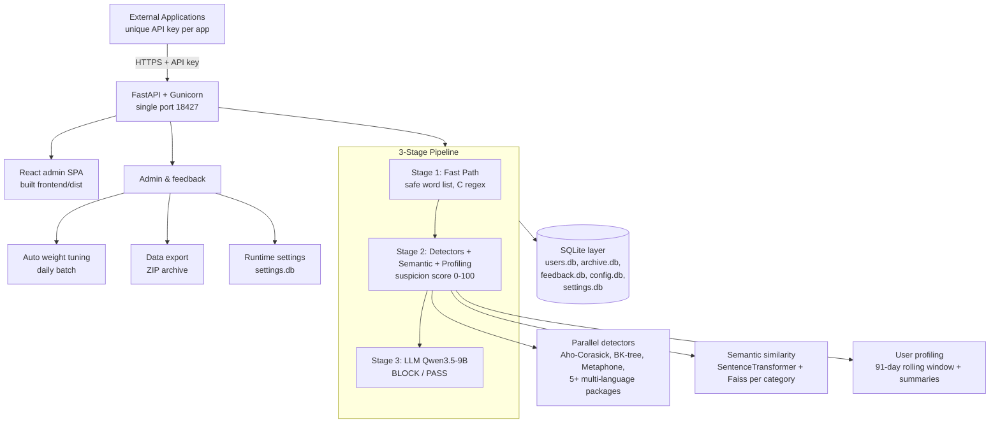

# Architecture

General Moderation is a high-performance, multi-tenant content moderation
service that pre-filters content before human review. It combines fast-path
rule detection with semantic similarity, user behavior profiling, and an
optional locally hosted LLM.

## Native-Core Design

The service is **maximally optimized by layering Python over compiled
engines**: Python is the surface glue that orchestrates state, policy, and
routing, while every hot path is delegated to C, C++, Rust, or WebAssembly
underneath — exact matching runs in C, fuzzy distance in C, hashing in C,
profanity lists in Rust, sandboxed evaluation in WebAssembly, validation and
serialization in Rust, persistence in C (SQLite), and inference in C++
(llama.cpp). The full inventory of native engines and the per-request
execution path are documented in [Performance
Engineering](/architecture/performance).



## Components



## Directory Layout

```
backend/
├── app/
│   ├── ai/            # llama.cpp model, download, prompts
│   ├── detectors/     # rule-based detectors (C/C++/Rust backed)
│   ├── fastpath/      # Stage 1 safe word list + language detection
│   ├── semantic/      # SentenceTransformer + Faiss per category
│   ├── profiling/     # 91-day user stats + cycle summaries
│   ├── scoring/       # suspicion score
│   ├── feedback/      # corrections + auto-tuning
│   ├── export/        # full system ZIP export
│   ├── settings_service.py
│   ├── engine/        # 3-stage pipeline orchestration
│   └── admin/         # admin REST endpoints
frontend/              # React + Ant Design admin console
docs/                  # VitePress documentation
deployment/            # Docker, systemd, nginx, frp
scripts/               # build, deploy, secret generation
```

## Performance Targets

| Target | Value |
| :--- | :--- |
| Content handled without the LLM | 95%+, under 200 ms latency |
| LLM invocation | under 5% of traffic |
| Rule-based checks | sub-millisecond |
| Semantic query | under 50 ms |
