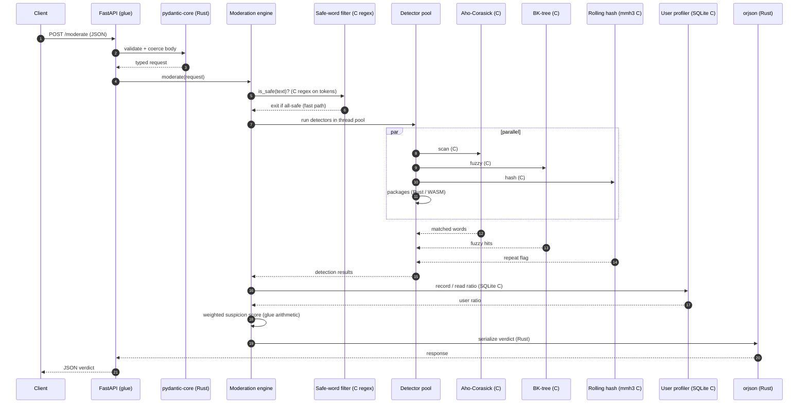
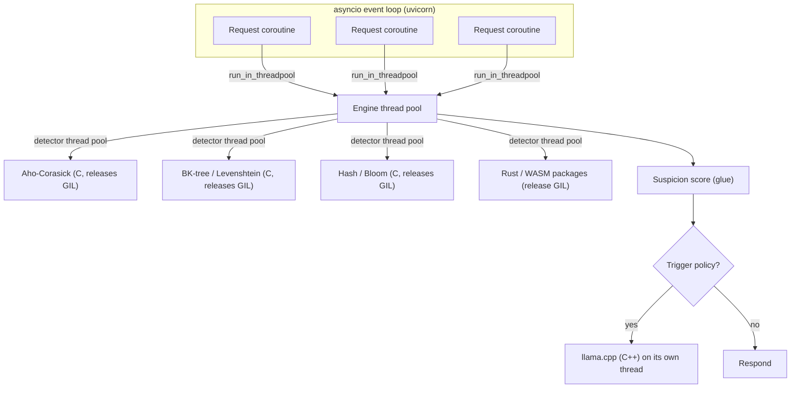
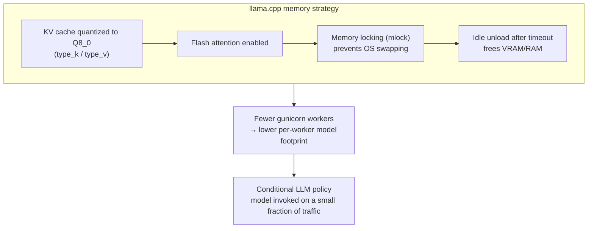
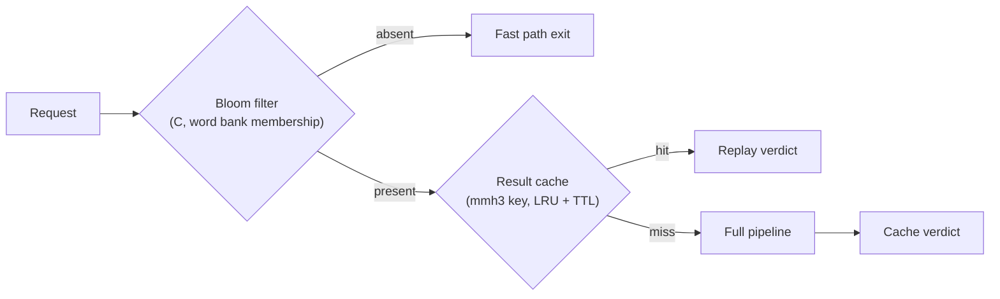
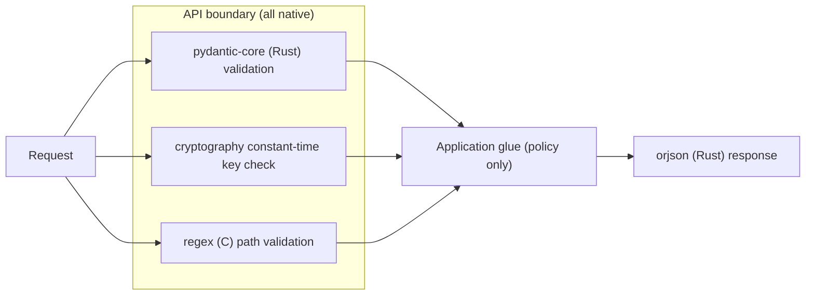
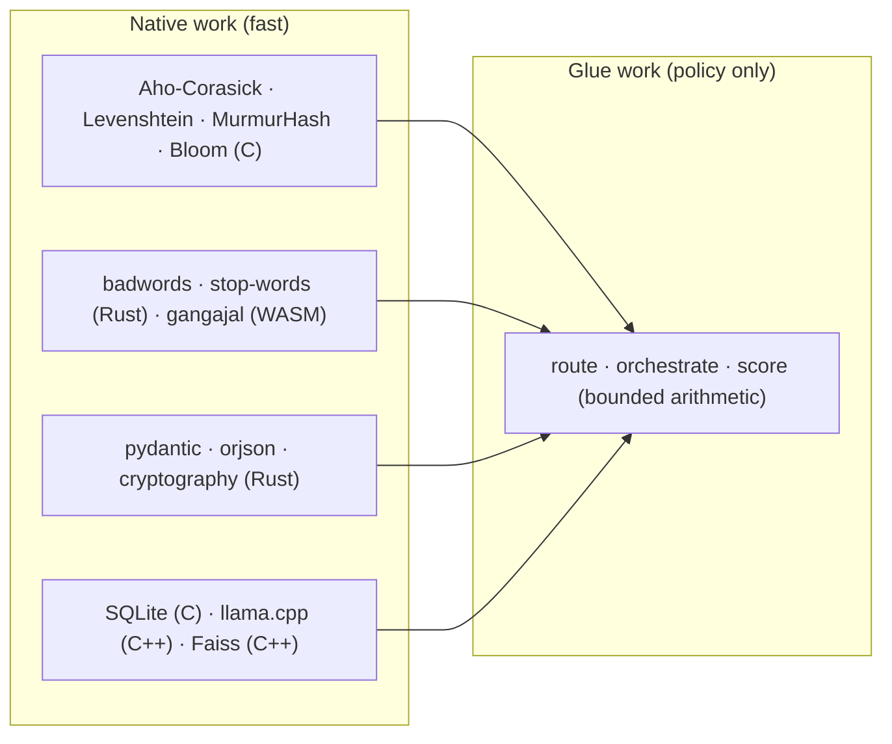

# Performance Engineering: Native Cores Under Python Glue

General Moderation is **maximally optimized** by a deliberate architectural
policy: **Python is the surface glue layer, and every hot path delegates its
heavy lifting to a compiled native engine** — C, C++, Rust, or WebAssembly.
The Python layer owns orchestration, policy, and flexibility; the native layer
owns arithmetic, string matching, hashing, encoding, validation, and inference.

This page maps the entire optimization surface: the layered native stack, the
per-request execution path, the concurrency model, the memory-management
strategy, and the caching tier.

---

## 1. Design Philosophy: Glue, Not Engine

The conventional mistake is to treat Python as the compute layer and bolt
native libraries on where "performance matters." This project inverts the
model: **the compute layer is native by default, and Python is the thin,
stateful orchestrator on top.**

```mermaid
flowchart TB
    subgraph Glue["Python surface glue layer"]
        API["FastAPI / Starlette — routing, DI, policy"]
        ENG["Moderation engine — stage orchestration"]
        PRO["User profiler — state, windows, summaries"]
        ADM["Admin console + settings + export"]
    end
    subgraph Bindings["Compiled binding layer (cpython extensions / FFI)"]
        PYA["pyahocorasick (C)"]
        LEV["python-Levenshtein (C)"]
        BLO["pybloom-live + mmh3 (C)"]
        REG["regex (Onigmo, C)"]
        ORJ["orjson (Rust)"]
        PYD["pydantic-core (Rust)"]
        CRY["cryptography (OpenSSL + Rust)"]
        LCP["llama-cpp-python (C++)"]
    end
    subgraph Native["Native runtime engines"]
        AC["Aho-Corasick automaton (C)"]
        LEV2["Levenshtein distance (C)"]
        BF["Bloom filter (C)"]
        MM3["MurmurHash3 (C)"]
        SQ["SQLite (C)"]
        L2["llama.cpp / GGUF inference (C++)"]
        FA["Faiss index (C++)"]
        BW["badwords-py (Rust)"]
        GAN["gangajal (WASM)"]
        STW["sensitive-stop-words (Rust)"]
        ONIG["Onigmo regex engine (C)"]
    end
    API --> PYD
    API --> ORJ
    ENG --> PYA --> AC
    ENG --> LEV --> LEV2
    ENG --> BLO --> BF
    ENG --> REG --> ONIG
    ENG --> LCP --> L2
    ENG --> BW
    ENG --> GAN
    ENG --> STW
    PRO --> SQ
    API --> CRY
    SEM["Semantic layer (optional)"] --> FA
```

Every arrow across the glue-to-native boundary represents work that Python
merely **dispatches and interprets the result of**, never re-implements.

---

## 2. The Native Library Inventory

| Responsibility | Python surface | Native engine | What the native layer accelerates |
| :--- | :--- | :--- | :--- |
| Exact multi-pattern search | `aho_detector.py` | `pyahocorasick` (C) | Scanning text once against the whole dictionary |
| CJK sensitive-word scan | `sensitive_stop_words_detector.py` | `ahocorasick-rs` (Rust) | Fastest scan path for the ~110k CJK terms; C `pyahocorasick` fallback |
| Fuzzy matching | `bktree_detector.py` | `python-Levenshtein` (C) | Edit-distance computation between tokens |
| Approximate membership | `bloom_detector.py` | `pybloom-live` + `mmh3` (C) | Constant-time "definitely not in set" rejection |
| Cache keys & hashing | engine cache | `mmh3` (C) | MurmurHash3 fingerprinting |
| Regex validation & safe words | fast path, admin routers | `regex` → Onigmo (C) | Compiled-pattern matching, filename validation |
| Word-level profanity | `multi_language_detector.py` | `badwords-py` (Rust) | Rust word lists with tight loops |
| WebAssembly profanity | `multi_language_detector.py` | `gangajal` (WASM) | Sandboxed wasm evaluation on-device |
| Script word lists | `sensitive_stop_words_detector.py` | `ahocorasick-rs` (Rust) | Rust Aho-Corasick over the merged CJK lists |
| Request validation | Pydantic models | `pydantic-core` (Rust) | Field validation at the API boundary |
| JSON serialization | FastAPI responses | `orjson` (Rust) | Sub-millisecond serialization |
| Secrets & signing | `security/` | `cryptography` (OpenSSL + Rust) | Constant-time compare, hashing |
| Persistence | profiler, settings, feedback | SQLite (C) | B-tree storage, transactions, indexes |
| Inference (optional) | `ai/llama_detector.py` | `llama.cpp` (C++) | GGUF quantization, attention, sampling |
| Vector search (optional) | `semantic/` | Faiss (C++) | ANN nearest-neighbor search |
| Embedding (optional) | `semantic/` | SentenceTransformers/torch (C++) | Transformer forward pass |

---

## 3. The Per-Request Execution Path

A single moderation request is a hand-off across several native engines.
The Python engine never computes a similarity, never walks a trie, and never
runs a transformer forward pass — it **orchestrates** those calls.

The only arithmetic performed in pure Python is the weighted sum of a small,
bounded set of signals — intentionally trivial so that no meaningful work is
ever done in the slowest layer.

---

## 4. Concurrency Model

The glue layer is asynchronous I/O, and the native work is dispatched to
thread pools so the GIL never serializes native calls (native extensions
release the GIL while they compute).

Key properties:

- **The event loop never blocks**: every request-visible computation is
  offloaded via `run_in_threadpool`.
- **Native extensions release the GIL**: C, Rust, and WASM compute runs in
  true parallelism across cores even within a single process.
- **Gunicorn workers** provide process-level parallelism for the LLM, whose
  C++ inference is long-running and memory-heavy.
- **Detector fan-out** uses a bounded `ThreadPoolExecutor` so a burst of
  requests cannot starve the pool.

---

## 5. Memory Management and LLM Optimization

The locally hosted model is engineered to fit, load, and release memory as
cheaply as possible.

| Optimization | Effect |
| :--- | :--- |
| KV-cache quantization (Q8_0) | Roughly halves KV memory versus FP16 |
| Flash attention | Reduces memory bandwidth during generation |
| `mlock` | Locks weights in RAM; the OS can never swap the model |
| Idle unload | Releases model memory after inactivity |
| Worker reduction | Bounds peak memory across processes |
| Conditional invocation | The expensive model runs only when rules are inconclusive |

---

## 6. The Caching and Pre-filter Tier

Before the engine touches the detector stack, two native-backed structures
short-circuit work:

- The **Bloom filter** gives a provable "definitely not in the word bank"
  answer in constant time, letting the fast path reject clean content before
  any trie scan.
- The **result cache** fingerprints each request with `mmh3` and serves
  repeated content from an LRU with TTL, so identical traffic bypasses the
  pipeline entirely.

---

## 7. Security Work Is Native Too

Security-critical operations are deliberately delegated to compiled code:

- **Input validation** happens in `pydantic-core` (Rust) at the API boundary
  before any application code runs.
- **API-key comparison** uses constant-time equality from `cryptography`.
- **Path and filename validation** uses compiled `regex` patterns, closing
  traversal before the filesystem is touched.
- **Serialization** of every response uses `orjson` (Rust), so no Python
  serializer is on the hot path.

---

## 8. Summary: Where Every Millisecond Goes

The performance posture in one sentence: **the Python layer decides what to
do, and the native layer does it.** Every algorithmic hot spot — string
matching, fuzzy distance, hashing, validation, serialization, persistence,
and inference — executes in C, C++, Rust, or WebAssembly; Python orchestrates
state and policy with near-zero cost because it performs almost no compute of
its own.

## Related Documentation

- [Architecture Overview](../architecture/)
- [3-Stage Pipeline](../architecture/pipeline)
- [Algorithms](../algorithms/)
- [Security](../guide/security)
