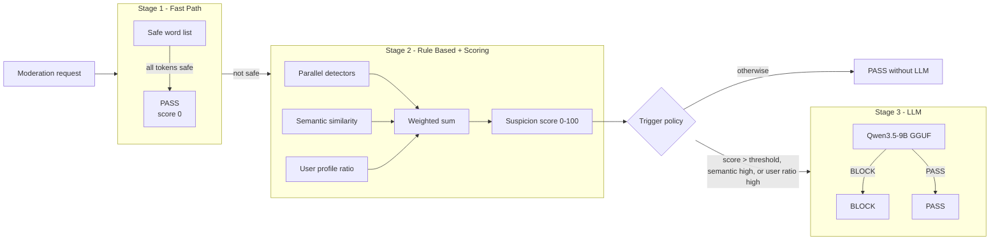

# The 3-Stage Pipeline

Every moderation request passes through three stages. Stage 1 exits clean
traffic immediately; Stage 2 computes a suspicion score; Stage 3 invokes the
LLM only when the trigger policy demands it.

## Stage 1 — Fast Path

Content composed entirely of safe words exits in under a millisecond. The
safe word list is stored in `data/safe_words.txt`, editable through the admin
UI, and language agnostic. Language detection (script heuristic or the
optional `langdetect`/`fasttext` package) informs later stages and falls back
to English.

## Stage 2 — Rule Based and Suspicion Scoring

The ordered detectors run against the text:

1. Sensitive-stop-words (Rust/C Aho-Corasick over the merged CJK lists, top
   priority, hard-blocks on a match)
2. Bloom filter (exact, word bank)
3. Rolling hash (repeated spam)
4. Aho-Corasick (exact multi-pattern, word-bank base words with an ASCII
   word-boundary guard)
5. BK-tree (Levenshtein <= 2, custom words only)
6. Double Metaphone (phonetic variants, custom words only)
7. Multi-language packages (26+ languages, thread-pooled)
8. Phrase detector (severity-aware critical phrases)

Semantic similarity encodes the text and searches one Faiss index per
category (`political`, `violence`, `sexual`, `hate`, `pii`, `ads`, `other`).
The user bad-content ratio comes from the 91-day profiling window plus all
archived cycle summaries.

The suspicion score is the weighted sum of detector hits, category
similarities above threshold, and the user ratio, clamped to 0–100:

\[
\text{score} = \sum_{d} \text{hit}_d \cdot w_d + \sum_{c} [s_c > \theta_c] \cdot w_c + \text{ratio}_u \cdot w_u
\]

Two severity-aware mechanisms can short-circuit or boost the score:

- A phrase with `severity >= SEVERITY_HARD_BLOCK_THRESHOLD` (default 5, per-app
  overridable) hard-blocks regardless of the score.
- The strongest matched severity applies a floor to the suspicion score so low
  scores cannot mask severe content.
- Weak signals (matched detectors but score below `REVIEW_ESCALATION_THRESHOLD`)
  escalate to REVIEW instead of silently passing.

## Stage 3 — LLM

The LLM runs only when the per-app trigger policy fires:

- `score_threshold`: the suspicion score that alone triggers the LLM.
- `semantic_boost`: a similarity above `SEMANTIC_FORCE_LLM_THRESHOLD`.
- `user_ratio_boost`: a user ratio above `USER_RATIO_THRESHOLD`.
- `logic_type`: `"or"` (any condition) or `"and"` (all conditions).

Per-app `llm_mode` (`auto`, `aggressive`, `passthrough`) controls how often the
LLM is consulted. The model replies `BLOCK` or `PASS`; any chunk of a long
message can trigger the LLM, and the final verdict is `BLOCK` if any chunk
blocks. A Stage-2 hard block is always preserved: if the LLM is unavailable
after a trigger fires, the pre-existing BLOCK stands and only ambiguous content
becomes REVIEW (`model_unavailable_total` metric counts the fallback).

See [Archive Strategy](/architecture/archive-strategy), [Semantic
Similarity](/algorithms/semantic-similarity), [Suspicion
Score](/algorithms/suspicion-score), and the [Credits](/guide/credits) page for
the word-list sources.
