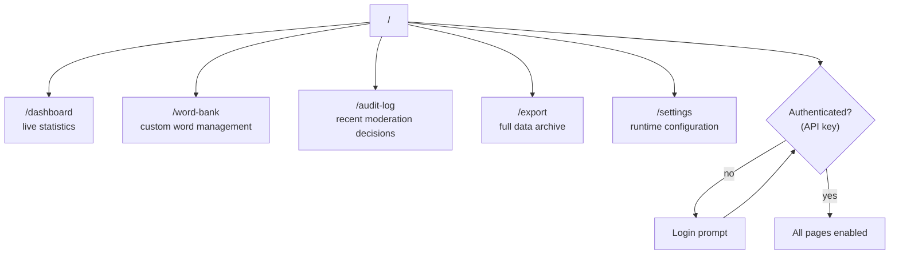
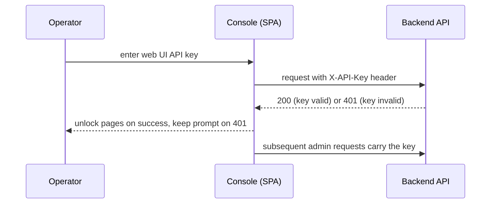
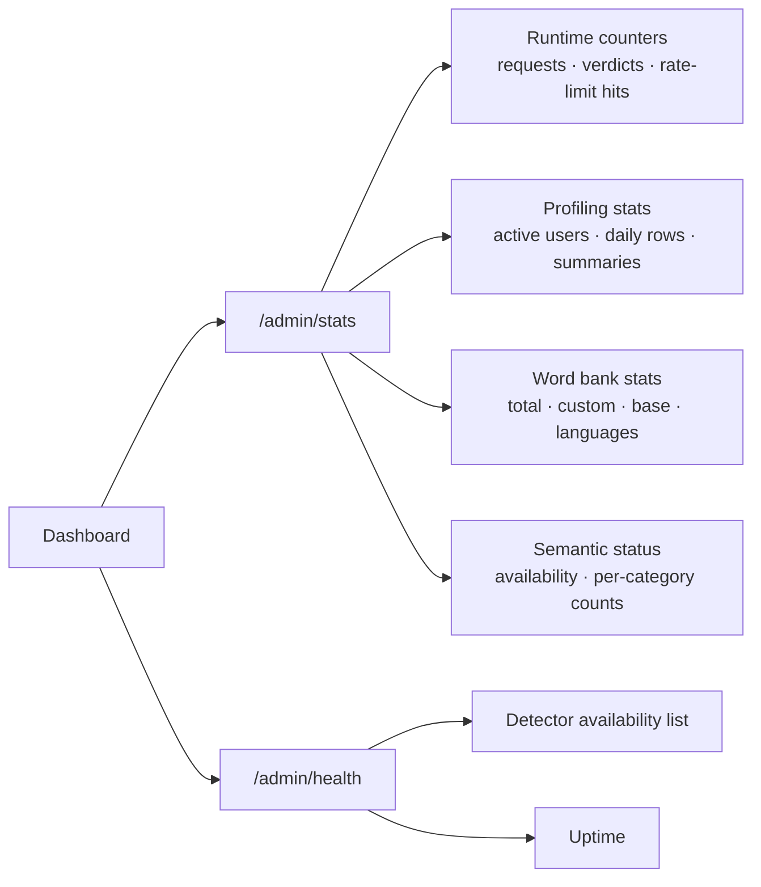
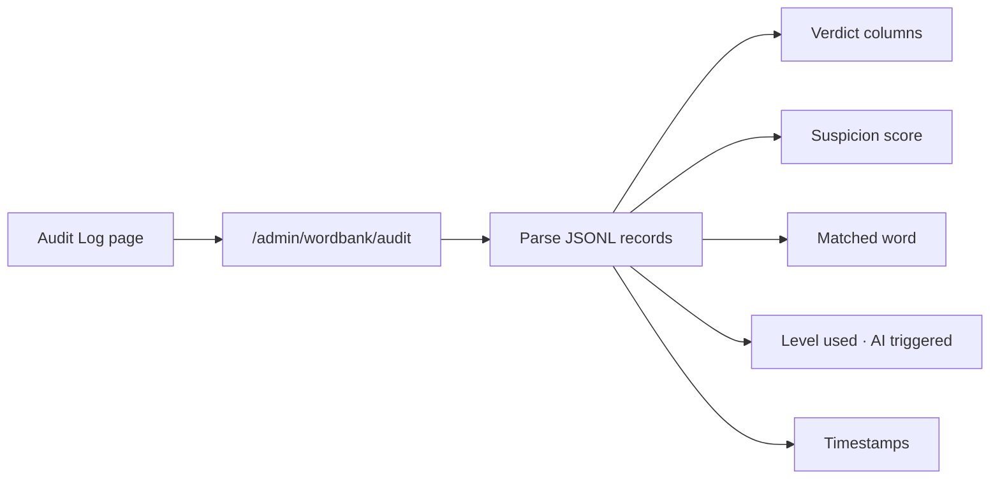
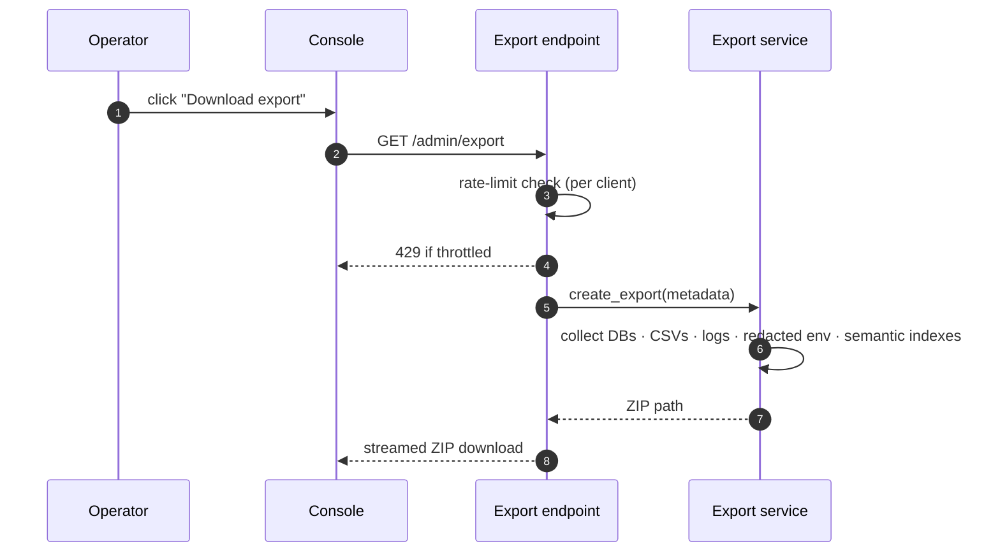
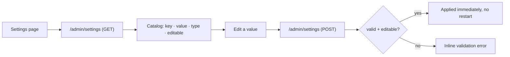

# Admin Console

The administration console is a React + TypeScript + Ant Design single-page
application served by FastAPI on the same port as the API. It is the
operational control plane for the moderation service: live statistics, word
bank management, audit inspection, runtime settings, and full data export —
all without a restart.

## Page Map

## Authentication

The console is gated by a single API key (the `WEBUI_API_KEY`). Until a key
is entered, the UI shows a login prompt and every request is deferred.

The key is held in browser memory only; it is never persisted to local
storage.

## Dashboard

The dashboard is the at-a-glance operational view. It renders the live
service state pulled from `/admin/stats` and `/admin/health`.

The cards update from these endpoints; any unavailable component (semantic
stage without its optional dependencies, or the LLM before a model is
loaded) is surfaced explicitly rather than hidden.

## Word Bank

The word bank page manages the custom dictionary that feeds the compiled
detectors. Because every mutation triggers an atomic rebuild of the
Aho-Corasick automaton and Bloom filter, the effects are visible to the
moderation pipeline immediately.

```mermaid
flowchart LR
    subgraph UI["Word Bank page"]
        ADD["Add word form"]
        SEARCH["Search / filter"]
        LIST["Word table"]
        IMPORT["Bulk import"]
        EXPORT["Export words"]
    end
    ADD --> WB["/admin/wordbank/words (POST)"]
    LIST --> UPD["/admin/wordbank/words/{id} (PUT)"]
    LIST --> DEL["/admin/wordbank/words (DELETE)"]
    SEARCH --> GET["/admin/wordbank/words (GET)"]
    IMPORT --> IMP["/admin/wordbank/import (POST)"]
    EXPORT --> EXPW["/admin/wordbank/export (GET)"]
    GET --> AHO["Detector snapshot rebuild<br/>(C automaton + Bloom)"]
    UPD --> AHO
    DEL --> AHO
```

Each word carries a `language`, `category`, and `severity`. The console
surfaces validation errors inline (empty or over-long words, out-of-range
severity, duplicates).

## Audit Log

The audit log page reads the JSONL moderation trail and presents the recent
decisions for human review — the same data the auto-tuning pipeline learns
from.

## Export

The export page triggers a complete data archive and downloads the ZIP. The
backend builds the archive in a staging directory, streams it back, and
cleans it up in the background.

The archive contains every database, per-table CSV dumps, log files,
semantic index files, a redacted `.env`, a settings snapshot, and a metadata
manifest — see the [Data Export](/guide/data-export) guide for the full
contents.

## Settings

The settings page exposes the entire runtime configuration catalog. Every
entry is rendered with its type, description, and editability; read-only and
secret keys are locked in the UI and rejected by the API.

### Editable Groups

| Group | Representative keys |
| :--- | :--- |
| Detection weights | `WEIGHT_DETECTOR_*`, `WEIGHT_SEMANTIC_*`, `WEIGHT_USER` |
| Semantic thresholds | `SEMANTIC_SIMILARITY_THRESHOLD`, `SEMANTIC_FORCE_LLM_THRESHOLD`, `SEMANTIC_TOP_K` |
| Profiling | `USER_WINDOW_DAYS`, `USER_RATIO_THRESHOLD`, `USER_SCORE_MODIFIER` |
| Sensitive stop words | `ENABLE_SENSITIVE_STOP_WORDS`, `ENABLE_SENSITIVE_STOP_WORDS_POLITICAL/PORN/GUN/AD/URL`, `SENSITIVE_STOP_WORDS_DIR`, `SENSITIVE_WORD_DATA_DICT`, `SENSITIVE_LEXICON_DIR`, `SENSITIVE_DICT_PATH` |
| Severity & review | `SEVERITY_HARD_BLOCK_THRESHOLD`, `REVIEW_ESCALATION_THRESHOLD`, `ML_REVIEW_MODE`, `ENABLE_PHRASE_DETECTOR` |
| Auto-tuning | `AUTO_TUNING_ENABLED`, `WEIGHT_DECAY_HALF_LIFE_DAYS`, `AUTO_TUNING_BATCH_HOUR` |
| LLM runtime | `MODEL_CONTEXT_SIZE`, `MODEL_MAX_TOKENS`, `MODEL_CACHE_TYPE_K/V`, `MODEL_IDLE_TIMEOUT_SECONDS` |
| Cache | `CACHE_MAX_SIZE`, `CACHE_TTL_SECONDS` |
| Rate limiting | `RATE_LIMIT_REQUESTS`, `RATE_LIMIT_PERIOD` |
| Logging | `LOG_LEVEL`, `LOG_MAX_BYTES`, `LOG_BACKUP_COUNT`, `LOG_RETENTION_DAYS` |

Changes apply immediately and persist in `settings.db`; no restart is
required.

## Related Documentation

- [Admin API](/api/admin)
- [Runtime Settings](/guide/admin-settings)
- [Data Export](/guide/data-export)
- [Security](/guide/security)
