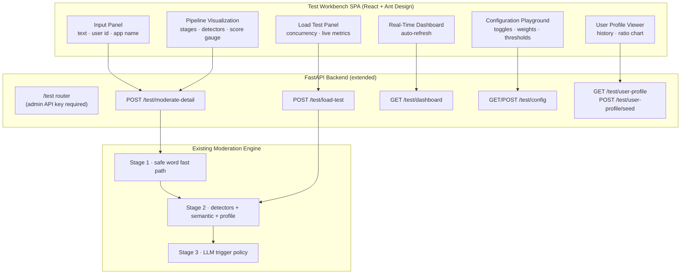
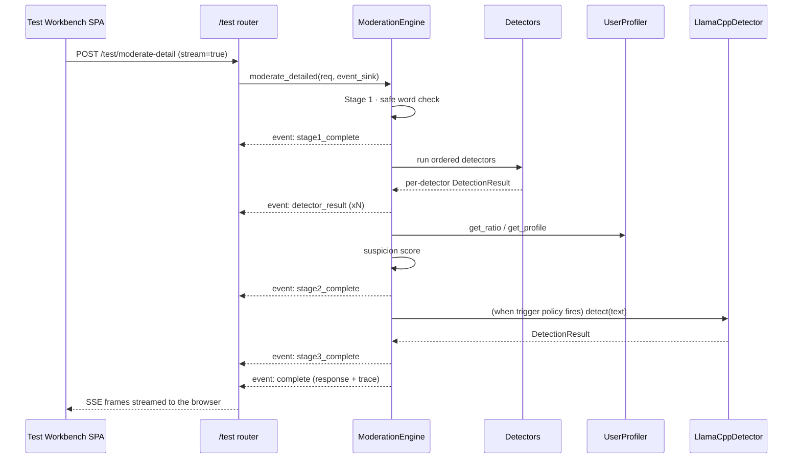
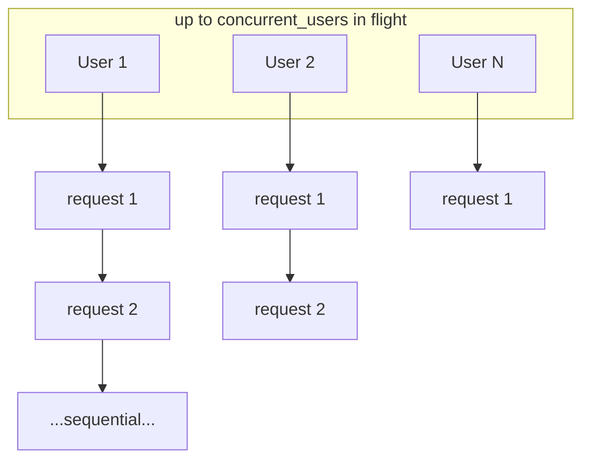

# Test Workbench

The **Test Workbench** is a developer tool built into the admin console at
`/test-workbench`. It drives the real, production moderation pipeline
interactively so you can:

- moderate any message and watch every stage of the decision execute live,
- see exactly which detectors fired, what they matched, and how the suspicion
  score was assembled,
- load-test the engine under simulated concurrency and watch throughput and
  latency percentiles update in real time,
- tune runtime settings and toggle detectors with immediate effect,
- simulate user profiles and observe how the bad-content ratio influences the
  score,
- watch live dashboard metrics from today's audit records.

It complements (never replaces) the automated test suite. Every feature is
additive: the production `/moderate` endpoint, the detection logic, and the
scoring formula are unchanged.

---

## Table of Contents

1. [Overview](#overview)
2. [Access and Authentication](#access-and-authentication)
3. [Backend Architecture](#backend-architecture)
4. [Endpoint Reference](#endpoint-reference)
5. [Interactive Test Tab](#interactive-test-tab)
6. [The Pipeline Trace](#the-pipeline-trace)
7. [Live Streaming (SSE)](#live-streaming-sse)
8. [Load Test Tab](#load-test-tab)
9. [Configuration Tab](#configuration-tab)
10. [User Profiles Tab](#user-profiles-tab)
11. [Dashboard Tab](#dashboard-tab)
12. [Performance Measurement](#performance-measurement)
13. [Security Model](#security-model)
14. [Troubleshooting and Limitations](#troubleshooting-and-limitations)

---

## Overview

The workbench is a React + TypeScript + Ant Design page served by the same
FastAPI application that serves the admin console. It communicates exclusively
with the new `/test/*` routes, which live behind the admin API key and expose
the engine's internal pipeline state without altering production behavior.



The workbench routes reuse the same engine instance that serves production
traffic, so results are identical to what the public API would return for the
same input — except that the workbench returns the full trace of *why*.

### What the Workbench Is Not

- It is **not** a replacement for the pytest suite. The automated tests still
  cover regression and contract behavior; the workbench covers live inspection.
- It is **not** a load generator against the HTTP layer. The load test calls
  the engine directly in-process, so it measures engine throughput rather than
  network/WSGI overhead.
- It is **not** an attack surface reducer. All routes require the admin API
  key, exactly like the rest of the admin console.

---

## Access and Authentication

1. Start the backend (see [Getting Started](/guide/getting-started)).
2. Build or serve the frontend and open `/test-workbench` in the admin console.
3. Enter the admin API key (`ADMIN_API_KEY`) in the console login prompt if
   you have not already.

Every request to `/test/*` carries the `X-API-Key` header set to the admin API
key. The key is compared with a constant-time comparison (`hmac.compare_digest`);
a missing, empty, or incorrect key returns HTTP `401`:

```json
{
    "detail": "Invalid or missing API key"
}
```

There is no separate rate limit on the `/test` routes. They are as
restricted as the rest of the admin API and are intended for developer use.

### API Base URL

When using the vite dev server, `/test` requests are proxied to the backend
automatically. When calling the API directly:

- Backend: `http://127.0.0.1:18427`
- Public VPS: `http://127.0.0.1:9000`

---

## Backend Architecture

The workbench is implemented as a new package under `backend/app/test/`:

| File | Responsibility |
| :--- | :--- |
| `pipeline_trace.py` | Immutable dataclasses describing one moderation run in full |
| `load_test.py` | The concurrent load test runner and its config/result models |
| `router.py` | The `/test/*` FastAPI routes, SSE serialization, and the dashboard aggregator |
| `__init__.py` | Package marker and docstring |

The engine was extended with a single additive method:

- `ModerationEngine.moderate_detailed(request, event_sink=None, record_training=True)`
  runs the identical three-stage pipeline that `moderate()` runs, but also
  builds a `PipelineTrace` and — when an `event_sink` is provided — invokes it
  once per stage completion so the events can be streamed live over SSE.

The production `moderate()` method is now a thin wrapper around a shared
`_moderate_core()` implementation. The wrapper drops the trace and keeps the
caching, metrics, audit, and profile bookkeeping exactly as before. See
[The Pipeline Trace](#the-pipeline-trace) for the full structure.



---

## Endpoint Reference

All endpoints are mounted under `/test` and require the admin API key.

| Route | Method | Purpose |
| :--- | :--- | :--- |
| `/test/moderate-detail` | POST | Run the pipeline and return a full trace. JSON by default; SSE when `?stream=true` |
| `/test/pipeline-status` | GET | Stream one moderation run over SSE (message passed as a query parameter) |
| `/test/load-test` | POST | Run a concurrent load test, streaming `progress` and `complete` events over SSE |
| `/test/dashboard` | GET | Aggregate today's audit records into live metrics |
| `/test/config` | GET | Return the full settings catalog (same shape as `/admin/settings`) |
| `/test/config` | POST | Validate and apply a batch of settings immediately |
| `/test/user-profile` | GET | Return one user's profiling history, ratios, and totals |
| `/test/user-profile/seed` | POST | Record simulated user history for experiments |

Each route is documented in full in the
[Workbench API reference](/api/workbench).

---

## Interactive Test Tab

The first tab is the heart of the workbench. It lets you paste any message and
watch the entire pipeline run against the live engine.

### Input Panel

| Control | Description |
| :--- | :--- |
| Message textarea | The message to moderate. Max length 8192 characters (enforced by the API and the textarea). |
| User ID | Optional. When left empty, the browser generates one of the form `wb-<base36-timestamp>` so profile effects can be observed without typing an ID. |
| App name | A `Select` with the presets `default`, `web`, `mobile`, `forum`. The chosen app resolves the Stage 3 trigger policy from `config.db`. |
| **Moderate** button | Starts the pipeline and streams results. Shows a loading state while running. |
| **Sample Message** button | Pre-fills the textarea with `I will kill you tonight`, a known Stage 2/3 exercise. |

### What Happens When You Press Moderate

1. The SPA calls `POST /test/moderate-detail?stream=true` with
   `{text, user_id, app_name}`.
2. The backend starts a worker thread that runs `moderate_detailed()`.
3. As each stage completes, the worker pushes an SSE event into a thread-safe
   queue; the router streams the frames to the browser as they arrive.
4. The SPA renders each event incrementally: the step indicator advances, the
   detector table fills in row by row, and the gauge updates.
5. The final `complete` event carries the full response and trace, which the
   visualization uses for the definitive state.

Because the events are genuine live frames, a request that forces the LLM
visibly pauses at Stage 3 while the model generates — you are watching the
real pipeline, not a replay.

### Pipeline Visualization

A three-step `Steps` control shows the pipeline position:

| Step | Meaning |
| :--- | :--- |
| Fast Path | Stage 1 safe word check |
| Detectors | Stage 2 detectors, semantic similarity, user profiling |
| LLM | Stage 3 model invocation (only when the trigger policy fires) |

Below the steps are:

- A **dashboard-style gauge** rendering the 0–100 suspicion score. It is green
  below 30, amber from 30 to 59, and red at 60 and above.
- The **verdict** tag: `PASS` (green), `REVIEW` (orange), `BLOCK` (red).
- The **total latency** in milliseconds.
- The **level used** (`1` for rule-only decisions, `2` when the LLM ran).
- The list of **reasons** accumulated along the pipeline.
- The **user ID** when one was supplied.

### Stage 1 Card — Fast Path

Shows whether the message was entirely composed of safe-word-list tokens.

- **Yes** — the pipeline exited immediately with `PASS`; the stage latency is
  typically well under one millisecond.
- **No** — the message continued to Stage 2.

Displays the stage verdict and the stage latency in milliseconds.

### Stage 2 Card — Detectors and Scoring

The most detailed view. A table lists every detector that exists in the
pipeline, in priority order:

| Column | Description |
| :--- | :--- |
| Detector | Name, e.g. `sensitive_stop_words`, `bloom_filter`, `rolling_hash`, `aho_corasick`, `bk_tree`, `double_metaphone`, `multi_language`, `phrase_detector` |
| Status | `Clean` (green), `REVIEW` (orange, non-blocking match), `BLOCK` (red, blocking match), `Disabled` (runtime toggle off), `Unavailable` (library missing or no word bank) |
| Latency (ms) | Wall time spent inside that detector for this request |
| Weight | Suspicion points the detector would contribute on a match |
| Confidence | Detector confidence in 0.0–1.0, or `-` |
| Detail | The matched words and the human-readable reason, or `-` |

Two collapsible sections sit below the table:

- **Semantic Similarity** — one `Progress` bar per category (`political`,
  `violence`, `sexual`, `hate`, `pii`, `ads`, `other`), showing the maximum
  cosine similarity measured against that category's Faiss index. Bars above
  the `SEMANTIC_SIMILARITY_THRESHOLD` (default 0.85) are drawn red because they
  contribute weight.
- **Suspicion Score Breakdown** — a `List` of `WeightContribution` rows, one
  per contributing signal:

  ```json
  {
      "kind": "detector",
      "name": "aho_corasick",
      "value": 1.0,
      "weight": 30,
      "contributed": 30
  }
  ```

  - `kind` is `detector`, `semantic`, or `user`.
  - For a detector hit, `value` is `1.0`.
  - For a semantic category, `value` is the measured similarity and
    `contributed` is the full category weight (the weight is added when the
    similarity exceeds the threshold).
  - For a user, `value` is the bad-content ratio and `contributed` is
    `ratio × WEIGHT_USER`.

When profiling is enabled and a user ID was supplied, a **User Profile**
description shows the user's current bad-content ratio and ID.

### Stage 3 Card — LLM

Two outcomes:

- **Not invoked** — the trigger policy did not fire. This is the common case
  for clean and lightly suspicious traffic.
- **Invoked** — the model was consulted. The card shows:
  - the **trigger** explanation, e.g. `[or] score 55 > 50`,
  - whether the **model is available** (loaded GGUF),
  - the **model verdict** (`BLOCK` or `ALLOW`),
  - the **confidence** attached to that verdict,
  - the **latency** of the model call,
  - the exact **prompt** sent to the model and the raw **response**, in
    expandable `<pre>` blocks.

The trigger explanation is built from the same flags the engine computes:

| Flag | Description | Rendered as |
| :--- | :--- | :--- |
| `score_trigger` | `suspicion_score > score_threshold` | `score 55 > 50` |
| `semantic_force` | a category similarity ≥ `SEMANTIC_FORCE_LLM_THRESHOLD` | `semantic 0.93 >= 0.90` |
| `user_ratio_force` | `user_ratio ≥ USER_RATIO_THRESHOLD` | `user ratio 0.41 >= 0.30` |

The flags are joined with the app's `logic_type` (`or` or `and`).

---

## The Pipeline Trace

The trace is the structured record of everything the engine observed. It is
returned as JSON by the non-streaming `moderate-detail` call and inside the
final `complete` SSE event. Field names are snake_case (the trace is a
backend-internal structure; only the `response` object uses camelCase).

### Top Level

| Field | Type | Description |
| :--- | :--- | :--- |
| `request_id` | string \| null | Caller-supplied ID echoed back |
| `app_name` | string | The effective app (defaults to `default`) |
| `user_id` | string \| null | The caller-supplied user ID |
| `text` | string | The moderated message |
| `verdict` | string | `PASS`, `BLOCK`, or `REVIEW` |
| `suspicion_score` | number | 0–100 weighted score |
| `level_used` | number | `1` (rules) or `2` (LLM consulted) |
| `ai_triggered` | boolean | Whether the LLM was invoked |
| `reasons` | string[] | Accumulated human-readable reasons |
| `matched_words` | string[] | De-duplicated offending words |
| `matched_language` | string \| null | ISO code of the detected language |
| `confidence_score` | number \| null | Overall confidence, if any |
| `stage_1` | object | `Stage1Trace` |
| `stage_2` | object | `Stage2Trace` |
| `stage_3` | object \| null | `Stage3Trace`, or null when the LLM was not consulted |
| `total_latency_ms` | number | Total wall time in milliseconds |

### `stage_1` — `Stage1Trace`

| Field | Type | Description |
| :--- | :--- | :--- |
| `fast_path` | boolean | True when the safe word list exited the pipeline |
| `verdict` | string | `PASS` when on the fast path, otherwise the Stage 2 verdict |
| `latency_ms` | number | Stage 1 wall time |

### `stage_2` — `Stage2Trace`

| Field | Type | Description |
| :--- | :--- | :--- |
| `detector_results` | `DetectorRunTrace[]` | One record per detector |
| `semantic_similarities` | object | Category → maximum similarity |
| `semantic_enabled` | boolean | Whether the semantic stage was active |
| `user_profile` | object \| null | Profiler snapshot, or null when disabled or no user ID |
| `suspicion_score` | number | The 0–100 score |
| `weight_contributions` | `WeightContribution[]` | Score breakdown |
| `latency_ms` | number | Stage 2 wall time |

#### `DetectorRunTrace`

| Field | Type | Description |
| :--- | :--- | :--- |
| `name` | string | Detector identifier |
| `enabled` | boolean | Whether the runtime toggle allowed it to run |
| `available` | boolean | Whether it reported itself usable |
| `matched` | boolean | Whether it flagged the text |
| `blocking` | boolean | Whether a match alone yields `BLOCK` |
| `confidence` | number \| null | Detector confidence, if reported |
| `matched_words` | string[] | Words or phrases that triggered it |
| `matched_language` | string \| null | Detected language, if any |
| `reason` | string \| null | Explanation of the match |
| `latency_ms` | number | Wall time in the detector |
| `weight` | number | Suspicion points contributed on a match |

#### `WeightContribution`

| Field | Type | Description |
| :--- | :--- | :--- |
| `kind` | string | `detector`, `semantic`, or `user` |
| `name` | string | Component name (detector ID, category, or `user_ratio`) |
| `value` | number | The measured signal |
| `weight` | number | The configured weight |
| `contributed` | number | Points added to the score |

### `stage_3` — `Stage3Trace`

| Field | Type | Description |
| :--- | :--- | :--- |
| `invoked` | boolean | Whether the LLM was called |
| `trigger` | string \| null | Human-readable trigger reason |
| `model_available` | boolean | Whether the GGUF model was loaded |
| `prompt` | string \| null | The exact prompt sent to the model |
| `response` | string \| null | The raw model reply |
| `verdict` | string \| null | `BLOCK` or `ALLOW` |
| `confidence` | number \| null | Confidence attached to the verdict |
| `latency_ms` | number | Wall time of the model call |

### The `response` Object

The `response` mirrors the public `ModerationResponse` model and uses
**camelCase** aliases:

```json
{
    "id": null,
    "verdict": "BLOCK",
    "allowed": false,
    "levelUsed": 2,
    "aiTriggered": true,
    "suspicionScore": 55.0,
    "reasons": ["Exact sensitive word matched in Aho-Corasick automaton"],
    "reason": "Exact sensitive word matched in Aho-Corasick automaton",
    "matchedWords": ["badword"],
    "matchedWord": "badword",
    "matchedLanguage": null,
    "confidenceScore": 1.0,
    "latencyMs": 3.2,
    "detectorChain": ["bloom_filter", "rolling_hash", "aho_corasick"]
}
```

### How the Suspicion Score Is Assembled

The score is a weighted sum, clamped to 0–100:

```text
score = Σ(detector weight for every matched detector)
      + Σ(category weight for every category whose similarity > SEMANTIC_SIMILARITY_THRESHOLD)
      + user_ratio × WEIGHT_USER
```

The detector → weight resolution used by both the engine and the trace:

| Detector | Settings key | Default |
| :--- | :--- | :--- |
| `sensitive_stop_words` | `WEIGHT_DETECTOR_AHO` | 30 |
| `bloom_filter` | `WEIGHT_DETECTOR_AHO` | 30 |
| `rolling_hash` | `WEIGHT_DETECTOR_AHO` | 30 |
| `aho_corasick` | `WEIGHT_DETECTOR_AHO` | 30 |
| `bk_tree` | `WEIGHT_DETECTOR_BKTREE` | 20 |
| `double_metaphone` | `WEIGHT_DETECTOR_METAPHONE` | 15 |
| `multi_language` | `WEIGHT_DETECTOR_BADWORDS` | 25 |

Semantic categories resolve to their own weights:

| Category | Settings key | Default |
| :--- | :--- | :--- |
| `political` | `WEIGHT_SEMANTIC_POLITICAL` | 35 |
| `violence` | `WEIGHT_SEMANTIC_VIOLENCE` | 40 |
| `sexual` | `WEIGHT_SEMANTIC_SEXUAL` | 30 |
| `hate` | `WEIGHT_SEMANTIC_HATE` | 35 |
| `pii` | `WEIGHT_SEMANTIC_PII` | 25 |
| `ads` | `WEIGHT_SEMANTIC_ADS` | 15 |
| `other` | `WEIGHT_SEMANTIC_POLITICAL` | 35 |

### When Is the LLM Invoked?

Stage 3 consults the per-app trigger policy from `config.db`:

1. `score_trigger` — `suspicion_score > score_threshold` (default threshold 50).
2. `semantic_force` — some category similarity `≥ SEMANTIC_FORCE_LLM_THRESHOLD`
   (default 0.90) and the app has `semantic_boost` enabled.
3. `user_ratio_force` — `user_ratio ≥ USER_RATIO_THRESHOLD` (default 0.30) and
   the app has `user_ratio_boost` enabled.

The policy's `logic_type` combines them (`or` by default; `and` requires all
three). Outcomes:

- No trigger → `level_used = 1`; the Stage 2 verdict is downgraded to `PASS`
  unless a blocking detector already produced `BLOCK`.
- Trigger + model **unavailable** → `level_used = 2`, verdict `REVIEW`.
- Trigger + model available → `level_used = 2`; `BLOCK` if the model replies
  `BLOCK`, otherwise `PASS`.

---

## Live Streaming (SSE)

The `moderate-detail` endpoint with `?stream=true` and the `load-test` endpoint
return `text/event-stream` responses. Every frame follows the SSE format:

```text
event: <name>
data: <json>

```

`GET /test/pipeline-status` is a query-parameter variant of the streaming
`moderate-detail` call: pass the message as `?text=...` and it streams the
identical event sequence for the same pipeline run. It is intended for scripts
and simple browser clients that want the live trace without a POST body.

The browser parses these frames incrementally, so the UI updates as the events
arrive rather than after the request completes.

### `moderate-detail` Event Sequence

In order of emission:

| Event | Payload |
| :--- | :--- |
| `stage1_complete` | `{stage: 1, fast_path, verdict, latency_ms}` |
| `detector_result` | `{name, matched, blocking, confidence, matched_words, reason, latency_ms}` — one per detector |
| `stage2_complete` | `{stage: 2, suspicion_score, latency_ms, semantic_similarities, user_profile, weight_contributions}` |
| `stage3_complete` | `{stage: 3, invoked, trigger, model_available, prompt, response, verdict, confidence, latency_ms}` |
| `complete` | `{response, trace}` |
| `error` | `{detail}` — emitted instead of `complete` when the pipeline raises |

Example of a complete stream for a blocking message:

```text
event: stage1_complete
data: {"stage":1,"fast_path":false,"verdict":"REVIEW","latency_ms":0.11}

event: detector_result
data: {"name":"bloom_filter","matched":true,"blocking":false,"confidence":0.5,"matched_words":["badword"],"reason":"Token possibly present in word bank (Bloom hit)","latency_ms":0.03}

event: detector_result
data: {"name":"aho_corasick","matched":true,"blocking":true,"confidence":1.0,"matched_words":["badword"],"reason":"Exact sensitive word matched in Aho-Corasick automaton","latency_ms":0.02}

event: stage2_complete
data: {"stage":2,"suspicion_score":30.0,"latency_ms":1.2,"semantic_similarities":{},"user_profile":null,"weight_contributions":[{"kind":"detector","name":"aho_corasick","value":1.0,"weight":30,"contributed":30}]}

event: stage3_complete
data: {"stage":3,"invoked":false,"trigger":null,"model_available":false,"prompt":null,"response":null,"verdict":null,"confidence":null,"latency_ms":0.0}

event: complete
data: {"response":{...},"trace":{...}}
```

### `load-test` Event Sequence

| Event | Payload |
| :--- | :--- |
| `progress` | `{completed, total, elapsed_ms, rps, p50, p95, p99, errors, llm_invocations, verdicts}` |
| `complete` | The full `LoadTestResult` |

---

## Load Test Tab

The load test simulates realistic mixed traffic and reports performance
metrics, updating live while the test runs.

### Configuration

| Parameter | Range | Default | Description |
| :--- | :--- | :--- | :--- |
| Concurrent users | 1–1000 | 10 | Number of simulated users running in parallel |
| Requests per user | 1–100 | 10 | Messages each user sends |
| Text source | random / corpus / custom | random | Where the messages come from |
| Corpus / custom text | one message per line | — | The message pool for `corpus` and `custom` |

Total requests = `concurrent_users × requests_per_user`.

### Concurrency Model

Each user is an async task. Users are admitted by a semaphore of size
`concurrent_users`, so at most that many users are in flight at once. A single
user sends its `requests_per_user` messages sequentially. This mirrors the way
real applications behave: many clients each talking in turn.



Every request runs `engine.moderate_detailed()` with `record_training=False`,
which means:

- the response cache is bypassed, so identical messages are re-detected and
  the test measures real detection work,
- user profile rows are **not** written, so a stress run does not pollute the
  profiling data,
- feedback/decision rows are **not** written, so the auto-tuner is not skewed.

Each request also emits an audit record (`moderation_decision`) so the run is
visible in the dashboard and audit log.

### Text Sources

| Source | Behavior |
| :--- | :--- |
| `random` | ~65% of requests draw a random neutral message and ~35% draw a random risky message, exercising PASS, REVIEW, and BLOCK verdicts |
| `corpus` | Requests cycle through your list, one message per line |
| `custom` | Same list as `corpus`, treated as the exact workload |

### Live Metrics

While the test runs, the panel shows a progress bar and live values:

- **Completed** — `completed / total`.
- **RPS** — `(completed + failed) / elapsed_seconds`.
- **p50 / p95 / p99 (ms)** — latency percentiles over all completed requests so far.
- **LLM invocations** — how many requests consulted the model.

Progress events are emitted at least every `max(1, total / 100)` completed
requests and at least every 500 milliseconds, whichever comes first.

### Result Fields

On completion the full `LoadTestResult` is shown:

| Field | Description |
| :--- | :--- |
| `total_requests` | `concurrent_users × requests_per_user` |
| `successful_requests` | Requests that returned a verdict |
| `failed_requests` | Requests that raised an exception |
| `total_duration_ms` | Wall time of the whole run |
| `requests_per_second` | `successful / elapsed` |
| `latency_percentiles` | `{p50, p95, p99}` in milliseconds |
| `max_concurrency_reached` | Peak in-flight requests (equals the configured value under ideal scheduling) |
| `llm_invocation_count` | Requests that invoked the model |
| `error_distribution` | Exception type → count |
| `verdicts` | `PASS` / `BLOCK` / `REVIEW` counts |

### Percentile Calculation

The runner keeps every latency sample. A percentile is taken from the sorted
list using the nearest-rank method:

```text
index = round(p/100 × (n - 1))
value = sorted_latencies[index]
```

For example, with 10 latencies sorted `[1, 2, 3, 4, 5, 6, 7, 8, 9, 10]`:

- p50 → index 4 → `5`
- p95 → index 8 → `9`
- p99 → index 8 → `9`

### Export

- **CSV** — a `metric,value` table of the top-level result fields and the three
  percentiles.
- **JSON** — the full `LoadTestResult` object, pretty-printed.

Both trigger a browser download. No state is stored server-side.

---

## Configuration Tab

The configuration playground exposes the runtime settings that influence the
pipeline. Values are loaded from the settings database, edited locally, and
applied with **Apply Changes**.

### Detector Toggles

Toggling a detector off makes the pipeline skip it entirely; the trace records
it as `enabled: false`.

| Key | Label |
| :--- | :--- |
| `ENABLE_DETECTOR_BLOOM_FILTER` | Bloom Filter (fast negative) |
| `ENABLE_DETECTOR_ROLLING_HASH` | Rolling Hash (repeat spam) |
| `ENABLE_DETECTOR_AHO_CORASICK` | Aho-Corasick (exact match) |
| `ENABLE_DETECTOR_BK_TREE` | BK-Tree (fuzzy match) |
| `ENABLE_DETECTOR_DOUBLE_METAPHONE` | Double Metaphone (phonetic) |
| `ENABLE_DETECTOR_MULTI_LANGUAGE` | Multi-language packages |

> **Important:** the toggles are honored by the workbench pipeline. The
> production `/moderate` path is intentionally unchanged, keeping experiments
> isolated from live traffic. This is stated in the UI as well.

### Stage Toggles

| Key | Label |
| :--- | :--- |
| `SAFE_WORD_ENABLED` | Stage 1 safe word fast path |
| `SEMANTIC_ENABLED` | Stage 2 semantic similarity |
| `USER_PROFILING_ENABLED` | Stage 2 user profiling |

### Suspicion Weights

Weight range is 5–50.

| Key | Default | Contribution |
| :--- | :--- | :--- |
| `WEIGHT_DETECTOR_BADWORDS` | 25 | `multi_language` matches |
| `WEIGHT_DETECTOR_PROFANITE` | 20 | (multi-language package share) |
| `WEIGHT_DETECTOR_GLIN` | 20 | (multi-language package share) |
| `WEIGHT_DETECTOR_AHO` | 30 | `bloom_filter`, `rolling_hash`, `aho_corasick` |
| `WEIGHT_DETECTOR_BKTREE` | 20 | `bk_tree` |
| `WEIGHT_DETECTOR_METAPHONE` | 15 | `double_metaphone` |
| `WEIGHT_SEMANTIC_POLITICAL` | 35 | `political` and `other` categories |
| `WEIGHT_SEMANTIC_VIOLENCE` | 40 | `violence` category |
| `WEIGHT_SEMANTIC_SEXUAL` | 30 | `sexual` category |
| `WEIGHT_SEMANTIC_HATE` | 35 | `hate` category |
| `WEIGHT_SEMANTIC_PII` | 25 | `pii` category |
| `WEIGHT_SEMANTIC_ADS` | 15 | `ads` category |
| `WEIGHT_USER` | 20 | multiplied by the user's bad-content ratio |

### Thresholds and Targets

| Key | Range | Default | Meaning |
| :--- | :--- | :--- | :--- |
| `SEMANTIC_SIMILARITY_THRESHOLD` | 0–1 | 0.85 | Similarity above which a category contributes weight |
| `SEMANTIC_FORCE_LLM_THRESHOLD` | 0–1 | 0.90 | Similarity above which the LLM is forced |
| `USER_RATIO_THRESHOLD` | 0–1 | 0.30 | Bad-content ratio above which a user is boosted |
| `AI_TARGET_PERCENTAGE` | 0–100 | 5 | Target LLM traffic share used by auto-tuning |
| `USER_WINDOW_DAYS` | 7–365 | 91 | Length of the rolling profiling window |

### Applying Changes

1. Edit the values.
2. Press **Apply Changes** → `POST /test/config` with
   `{"settings": {key: value, ...}}`.
3. The backend validates every key (unknown, read-only, or out-of-range keys
   return HTTP 400) and persists the values to the settings database.
4. The settings cache reloads immediately, so the **very next** interactive
   moderation reflects the change.

The **Reload** button re-reads the server-side catalog and discards unsaved
edits.

---

## User Profiles Tab

This tab inspects and manipulates the per-user behavior profiling data.

### Controls

| Control | Description |
| :--- | :--- |
| App | App namespace; defaults to `default` |
| User ID | The user to inspect |
| **Load Profile** | Fetches `GET /test/user-profile` |
| Simulate New User | No-op seed (0 messages), then loads |
| Simulate Known Good | Seeds 50 messages, 1 flagged (2% ratio) |
| Simulate Known Bad | Seeds 50 messages, 40 flagged (80% ratio) |
| Refresh | Reloads the current profile |

Seeding calls `POST /test/user-profile/seed` with `{app_name, user_id,
total_msgs, flagged_msgs}`. It writes real rows through the profiler, so the
ratio immediately feeds back into the suspicion score on the next interactive
moderation with that user.

### Displayed Data

- **Statistic cards** — total messages, flagged, blocked, and the bad-content
  ratio (colored by severity: green ≤ 20%, amber ≤ 50%, red above).
- **Ratio Over Time** — a bar chart of the live rolling window: each daily row
  renders a bar whose fill reflects the flagged fraction and whose height
  reflects message volume. Hovering shows the exact date and counts.
- **Daily History** — a table of `user_daily_stats` rows: date, messages,
  flagged, blocked, reviewed, and per-day ratio.
- **Archived Cycles** — a summary tag per archived 91-day cycle with total and
  flagged counts.

The ratio combines the live window with every archived summary:

```text
ratio = (Σ flagged + Σ blocked across live and archived) / Σ total
```

---

## Dashboard Tab

The dashboard aggregates the **current UTC day's** audit records from the
JSONL audit log (`moderation_decision` entries only).

### Metrics

| Statistic | Source |
| :--- | :--- |
| Requests Today | Count of today's `moderation_decision` records |
| Block Rate | `blocked / total` |
| Avg Latency (ms) | Mean of `latencyMs` over today's records |
| LLM Invocation Rate | `aiTriggered / total` |

### Requests Over Time

A bar chart of requests bucketed by minute (`HH:MM` of the record timestamp),
from the oldest to the newest minute seen today.

### Most Frequent Detectors

A ranked list of detectors from today's `detectorChain` arrays, with a
normalized bar and the raw count.

### Engine Counters

The live runtime counters (`requests_total`, `requests_block_total`,
`ai_requests_total`, `semantic_queries_total`, `rate_limit_hits_total`, and
per-detector cumulative seconds).

### Auto-Refresh

The panel reloads every **5 seconds** automatically. The **Refresh** button
forces an immediate reload.

### Aggregation Method

The aggregator scans the audit log from newest to oldest, decoding each line
with `orjson`. It keeps only records whose `message` is `moderation_decision`
and whose `timestamp` starts with today's UTC date; once it reaches an older
record it stops, because the log is written chronologically.

---

## Performance Measurement

All latencies are wall-clock measurements taken with
`time.perf_counter_ns()` and reported in milliseconds:

- `stage_1.latency_ms` — the safe word check.
- each `DetectorRunTrace.latency_ms` — a single detector call.
- `stage_2.latency_ms` — semantic query + profiling + scoring (includes the
  detector table, which is measured separately).
- `stage_3.latency_ms` — the model inference call only.
- `total_latency_ms` — the whole pipeline, including audit and profile writes.

Because the values are real, they are the right tool for comparing detector
costs and for spotting slow model calls — but they are single-run samples, not
statistical benchmarks. Use the [load test](#load-test-tab) for distribution
statistics.

---

## Security Model

- Every `/test/*` route is guarded by `RequireAdminApiKey`, which compares the
  `X-API-Key` header using constant-time comparison. Missing or invalid keys
  get HTTP 401.
- Responses pass through the same security-headers middleware as the rest of
  the API (`nosniff`, `DENY` framing, CSP, HSTS).
- No secrets are exposed: the settings catalog redacts `*_KEY` and `*_SECRET`
  values, and the trace never contains API keys.
- The load test and interactive calls write audit records, but never prompt
  content into logs — the audit logger records only a text hash and a 50-char
  preview.
- Load tests skip profile and feedback writes (see
  [Load Test Tab](#load-test-tab)).

---

## Troubleshooting and Limitations

### Model Not Loaded

If Stage 3 shows `model_available: false`, the llama.cpp model is not loaded
(or the `llama-cpp-python` extra is not installed). Requests that trigger the
LLM policy will return `REVIEW` at `level_used = 2`. See the
[Getting Started](/guide/getting-started) guide for model setup.

### Semantic Similarity Disabled

If the semantic panel is empty and shows *disabled*, the optional `semantic`
extras (`torch`, `sentence-transformers`, `faiss-cpu`) are not installed.
Enable with:

```bash
uv sync --extra ai --extra semantic
```

### Python 3.14 Concurrency Panic

On Python 3.14, concurrent llama.cpp generation used to trigger a
stack-alignment assertion in some builds. Model inference is now serialized
behind a per-detector lock, so load tests and parallel requests never drive
llama.cpp from more than one thread at a time and the crash no longer occurs.
Heavy load tests may still run more predictably on Python 3.11–3.13, where
every compiled profanity package is fully optimized for the runtime's worker
threads.

### SSE and Multiple Workers

SSE streaming is in-memory and process-local. With a single worker (or the
vite dev server), each request is streamed by the worker that ran it. Behind
multiple gunicorn workers, a stream is served by whichever worker receives the
request — this is fine for interactive use but means a load test's progress is
not globally aggregateable across workers.

### Audit Log Growth

Every interactive moderation and every load-test request writes a
`moderation_decision` audit record. Very large load tests therefore grow the
log. The logger rotates at `LOG_MAX_BYTES` with `LOG_BACKUP_COUNT` backups.
