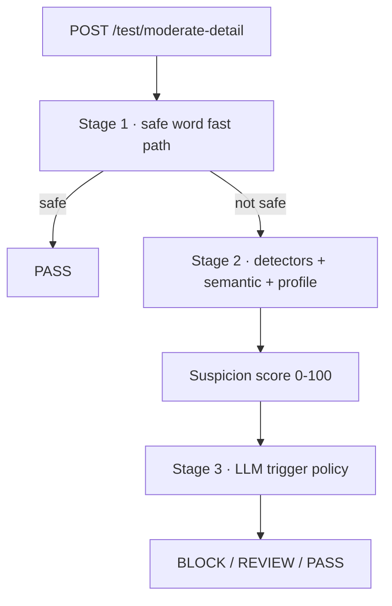

# Test Workbench

The Test Workbench is a developer tool built into the admin console at
`/test-workbench`. It drives the real moderation pipeline interactively so you
can inspect every stage of a decision, load-test the engine, tune runtime
settings, simulate user profiles, and watch live dashboard metrics — without
writing any pytest boilerplate.

It complements (never replaces) the automated test suite. All of the new
behavior is additive: the production `/moderate` endpoint and the detection
logic are unchanged.

## Endpoints

The workbench is backed by the `/test/*` routes, all guarded by the same admin
API key as the other admin endpoints:

| Route | Purpose |
| :--- | :--- |
| `POST /test/moderate-detail` | Run the pipeline and return a full trace (JSON, or SSE with `?stream=true`) |
| `POST /test/load-test` | Run a concurrent load test, streaming progress over SSE |
| `GET /test/dashboard` | Aggregate today's audit records into live metrics |
| `GET/POST /test/config` | Read and apply runtime settings immediately |
| `GET /test/user-profile` | Inspect one user's profiling history and ratio |
| `POST /test/user-profile/seed` | Record simulated user history for experiments |

The detailed trace reports the exact state of every stage:

## Interactive Test

Paste any message, optionally choose a user ID (auto-generated when empty) and
an application, then press **Moderate**. The pipeline runs live and the
results stream in:

- **Stage 1** shows whether the safe word fast path exited the message.
- **Stage 2** lists every detector with its match status, latency, weight, and
  confidence, plus the semantic similarity bars and the suspicion score
  breakdown (which detectors or categories contributed how many points).
- **Stage 3** shows whether the LLM was invoked, the trigger reason, the exact
  prompt, the model reply, and the confidence.
- A dashboard-style gauge renders the 0-100 suspicion score with green /
  yellow / red color coding.

The stream is genuine Server-Sent Events: each stage event arrives as the
pipeline produces it, so a request that forces the LLM visibly pauses at
Stage 3.

## Load Test

Configure concurrent users (1-1000), requests per user (1-100), and a text
source, then run. Users execute in parallel and each user sends its requests
sequentially, mirroring realistic traffic.

- `random` mixes neutral and risky messages.
- `corpus` cycles through a custom list, one message per line.
- `custom` uses the same list as an exact workload.

Progress streams live: completed count, requests per second, p50/p95/p99
latency, error count, and LLM invocations update as the test runs. On
completion the aggregated result is shown and can be exported as CSV or JSON.

Load tests bypass the response cache and skip profile/feedback writes so a
stress run does not pollute the tuning data.

## Configuration Playground

The configuration tab lists the runtime detector toggles, stage toggles,
suspicion weights, and thresholds. Changes are applied through the runtime
settings database and take effect on the very next interactive request.

Detector toggles only affect the workbench pipeline; the production endpoint
behavior is unchanged. This keeps experiments isolated from live traffic.

## User Profiles

Enter an app and user ID to view total messages, flagged/blocked counts, and
the bad-content ratio, plus the daily history and archived cycles. The
**Simulate** buttons seed a realistic history — a new user, a clean user, or a
flagged user — so you can watch how the ratio feeds into the suspicion score.

## Dashboard

The dashboard tab aggregates the day's audit records: total requests, block
rate, average latency, LLM invocation rate, the most frequent detectors, and a
per-minute request chart. It auto-refreshes every five seconds.

## Notes and Limitations

- The trace, load test, and dashboard run against the same engine that serves
  production traffic, so running large load tests consumes real CPU and writes
  audit records.
- On Python 3.14, concurrent execution of the compiled profanity packages can
  trigger a stack-alignment assertion in some builds. This is a pre-existing
  runtime issue unrelated to the workbench; single-threaded and low-concurrency
  runs are unaffected.
- SSE streaming is in-memory and process-local, so it works with a single
  worker process. Behind multiple gunicorn workers, each worker handles its own
  streams.
