# Testing Architecture

General Moderation treats its test suite as a **first-class distributed
system**, not a collection of scripts. The suite is engineered around four
non-negotiable properties — **determinism**, **isolation**, **parallel
throughput**, and **reproducible generation** — and is designed to scale from a
single developer laptop to a large CI fleet without changing a single test.

This page documents the architecture to expert depth: how tests are modeled,
discovered, parametrized, executed across every available core, isolated from
one another, generated from observed behavior, verified for uniqueness, and
extended into future phases.

---

## 1. Architectural Principles

The entire test system is governed by a small set of invariants. Every design
decision below derives from one of these.

| Principle | Meaning | Enforcement point |
| :--- | :--- | :--- |
| **Determinism** | A given test produces the same verdict on every run, on every machine, in any interleaving with other tests. | Frozen clock, seeded fixtures, golden literals, per-test sandboxes |
| **Isolation** | No test observes another test's state — filesystem, databases, logs, caches, or process globals. | Per-test sandbox directories, per-test database copies, process-per-worker |
| **Throughput** | The suite saturates every available compute unit; parallelism is dynamic, never configured by a magic number. | pytest-xdist with auto worker derivation |
| **Reproducibility** | Test expectations are captured from observed behavior and re-verified; nothing is hand-fabricated. | Golden-master generator with in-process oracles |
| **Extensibility** | Adding coverage never requires new infrastructure — only new rows in dimension matrices. | Data-driven generator + regenerated READMEs |
| **Verifiability** | Every artifact (tests, docs, uniqueness) is machine-checked. | Uniqueness report, collection assertions, lint gates |

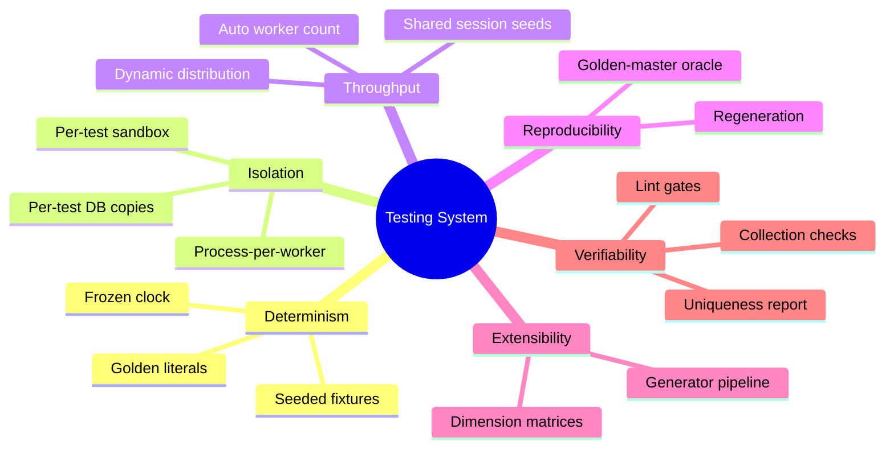

---

## 2. Test Taxonomy and Repository Topology

The suite is organized into **layers** by the seam they exercise, and each
layer is further split into **module suites** that own a bounded slice of the
product surface.

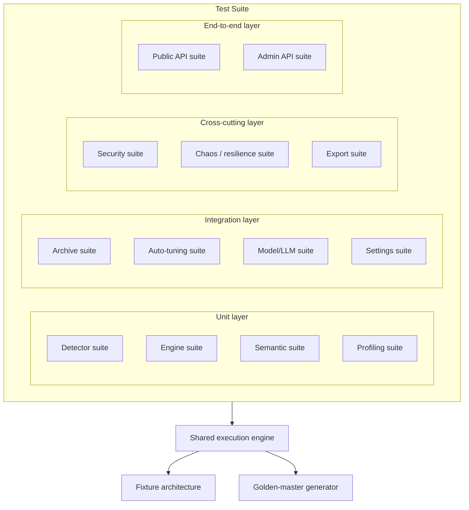

- **Unit layer** exercises a single component in isolation: individual
  detectors against a controlled word bank, the moderation pipeline against
  seeded dictionaries and thresholds, the semantic similarity service against
  a deterministic embedding oracle, and the user profiler against an
  in-memory database pair.
- **Integration layer** wires several services together: the archive cycle
  (profiler plus SQLite persistence), the auto-tuning batch (feedback
  ingestion plus weight/threshold mutation), the LLM boundary (sanitization,
  download retry, prompt assembly), and the runtime settings store
  (validation, coercion, read-only discipline).
- **Cross-cutting layer** owns concerns that span the product: export
  integrity and secret redaction, security headers and injection resistance,
  and chaos/resilience scenarios (malformed inputs, broken adapters,
  concurrency bursts, recovery ordering).
- **End-to-end layer** drives the fully wired FastAPI application through its
  ASGI interface, asserting the public moderation surface and the
  administrative surface as the operators see them.

Each module suite is a directory containing a documentation ledger and a set
of test files. Every test file is bounded in cardinality so that any single
file remains reviewable and debuggable; when a matrix grows past that bound,
the generator splits it into an additional file rather than enlarging an
existing one.

---

## 3. Discovery, Parametrization, and Collection

The runner discovers tests by filesystem convention, then expands each
parametrized case into its own **concrete execution unit** at collection time.

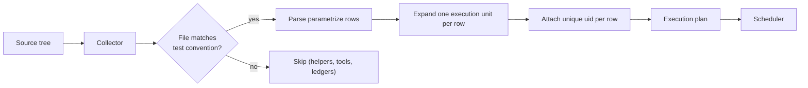

Two details make collection exact:

1. **Row expansion.** A parametrized method with a tuple of dimension rows
   yields one execution unit per row. The collector asserts the total number
   of units it expects, so a regression that silently drops rows (for example,
   by a generator change) fails collection immediately rather than quietly
   under-testing.
2. **Row uniqueness.** Every parametrized row carries a monotonically
   increasing, globally unique discriminator column. This guarantees the
   runner never collapses two rows that happen to carry identical dimension
   values — a failure mode that would otherwise reduce effective coverage
   without any error being raised.

---

## 4. Execution Engine: Dynamic Parallelism Across Every Core

The execution engine is **pytest + pytest-xdist**. The worker population is
derived from the runtime environment: the scheduler queries the logical CPU
count of the machine it is running on and spawns exactly that many worker
processes. There is no fixed worker constant in configuration, so a
single-core container, a developer workstation, and a high-core build machine
all behave optimally without any edits.

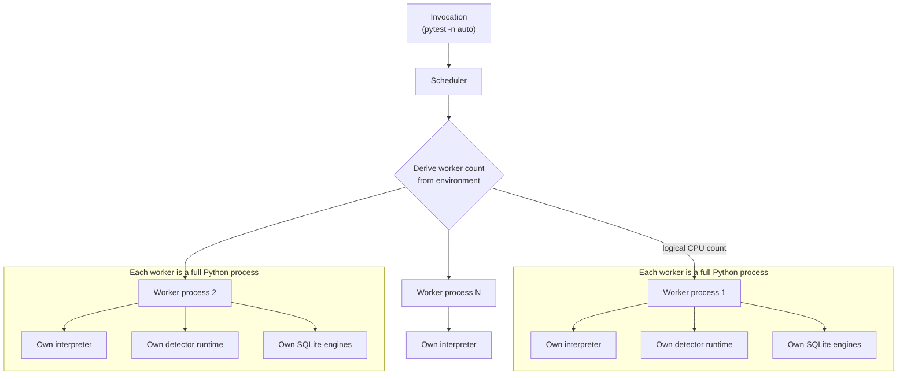

Why full processes rather than threads:

- The detector stack is a collection of C, C++, Rust, and WebAssembly
  bindings that release the GIL; only true parallelism extracts their
  throughput.
- SQLite, the audit logger, and the profiler hold file handles and
  connections; a process-per-worker keeps every one of those resources
  thread-confined and race-free.
- A worker crash (for example, a native detector fault) terminates only that
  worker; the scheduler isolates the failure instead of corrupting the whole
  run.

### 4.1 Work Distribution

The scheduler partitions the execution plan into slices of **test files**, not
individual tests. File-granular distribution has a decisive advantage for this
suite: a worker can build its session-scoped fixtures once and reuse them for
every file it owns, amortizing the most expensive setup across many tests.

```mermaid
sequenceDiagram
    autonumber
    participant S as Scheduler
    participant W1 as Worker A
    participant W2 as Worker B
    participant WN as Worker N
    participant Q as Execution queue

    S->>Q: enqueue file slices
    loop while slices remain
        Q->>W1: claim slice (files F1..Fk)
        Q->>W2: claim slice (files Fm..Fn)
        Q->>WN: claim slice (files Fp..Fq)
        activate W1
        W1->>W1: build session fixtures once
        W1->>W1: run owned files
        deactivate W1
    end
    Q-->>S: drained; aggregate results
```

Because distribution is dynamic, faster workers naturally claim more slices —
the engine self-balances without a static partition.

### 4.2 Determinism Under Parallelism

Parallelism never weakens determinism:

- Each worker owns a private filesystem sandbox root, so SQLite files, log
  files, and export archives from different workers never collide.
- Session-scoped fixtures are scoped **per worker**: every worker builds its
  own copy of the shared seeds, so there is zero cross-process shared mutable
  state.
- All time-dependent logic is driven through a **frozen clock** (below), so a
  test's outcome is independent of when, or on which worker, it executes.

---

## 5. Fixture Architecture

Fixtures are the connective tissue of the suite. They are designed on a
strict **scope ladder**: build once per session where a value is read-only or
immutable, build per test where a value must be isolated and mutable.

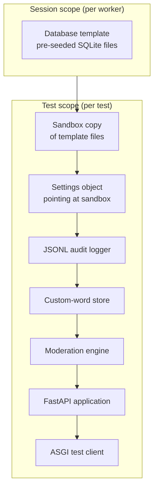

### 5.1 The Database-Template Pattern

The single largest per-test cost in a naive design is **schema construction
and seeding**: several SQLite databases must be created with tables, indexes,
and default rows before any service can run. Creating and seeding them inside
every test multiplies that cost across the entire suite.

The suite solves this with a **pre-seeded template**:

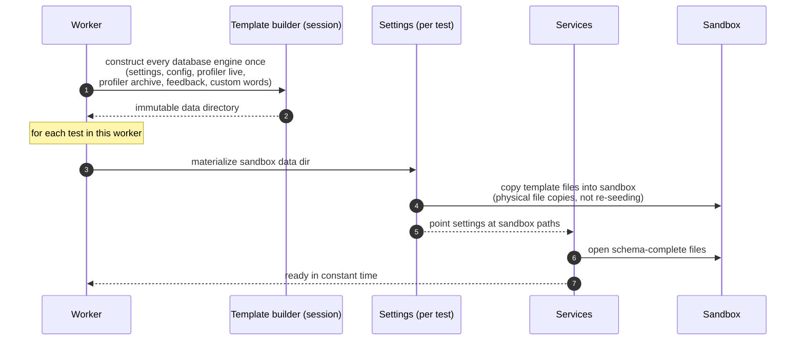

The template is **functionally immutable**: it is built once, then only ever
read and copied. Because SQLite writes are confined to the per-test copy, the
template can never be corrupted by a test, and every test still observes a
pristine, freshly materialized database set. Isolation semantics are
therefore identical to a naive per-test creation approach — only the constant
factor of setup changes, and it changes decisively.

This is the same shape of optimization a high-performance build system uses
for cache warming, or a database uses for cloning a snapshot: **amortize
expensive construction once, distribute cheap copies many times.**

---

## 6. Isolation and Sandboxing Model

Every test executes inside a **private sandbox** — a temporary directory
tree that is created on setup and discarded on teardown. The sandbox contains
every mutable artifact the product could touch:

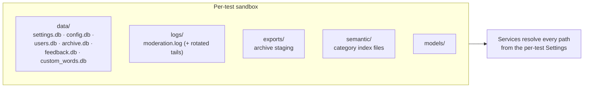

Because the settings object is constructed to point **exclusively** inside the
sandbox, the suite can never read or write the real `data/`, `logs/`,
`models/`, `semantic/`, or `exports/` directories of a running deployment.
This is a hard guarantee, not a convention: any service that opens a path
outside the sandbox fails the test that exercised it, because that path does
not exist in the sandbox.

The isolation guarantees, enumerated:

| Concern | Guarantee |
| :--- | :--- |
| Filesystem | Every writable path resolves inside the per-test sandbox |
| Databases | Physical copies per test; template is immutable |
| Logs | Per-test JSONL logger; rotation confined to the sandbox |
| Process globals | Per-test runtime; process-per-worker for native isolation |
| Time | Frozen, per-test clock with deterministic advancement |
| Concurrency | No cross-test mutable state; worker-local session scope |

---

## 7. Determinism: The Frozen Clock

Moderation is full of time-branched logic — long rolling profiling windows,
archive cycles, auto-tuning half-life decay, cache TTLs, log rotation. Naive
tests of this logic are flaky: their outcome depends on the wall clock.

The suite makes time a **controlled input**. A clock abstraction is frozen at
a fixed epoch instant and injected into every time-sensitive module. A test
advances the clock deterministically (`advance` by days or hours) to reach the
exact scenario boundary it targets.

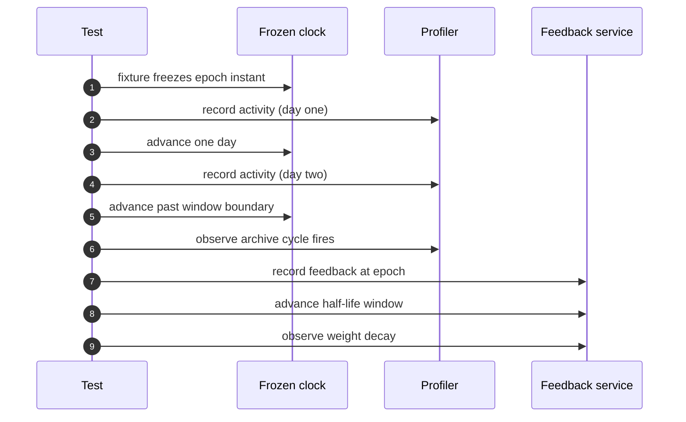

Because the clock is injected at the module seam, the same frozen instant is
visible to the profiler, the feedback/auto-tuning service, and any consumer
that branches on `now`. The result: archive cycles, decay curves, and TTL
expirations are tested with exactness — including boundary days, negative
offsets, and large gaps — without ever sleeping or relying on wall-clock
timing.

The frozen clock is a **session-stable epoch**: it is anchored once and
advanced only explicitly, so the same test on any machine, at any real time,
observes the same sequence of instants.

---

## 8. Golden-Master Generation Methodology

The expansive phase-two portion of the suite is not hand-written. It is
**emitted by a generator** that treats the real application as an oracle.
This is characterization testing at industrial scale: rather than asserting
what the software *should* do from first principles, the generator runs the
software, records what it *does*, and freezes that behavior as a golden
literal. Future regressions are then detected as deviations from the frozen
observations.

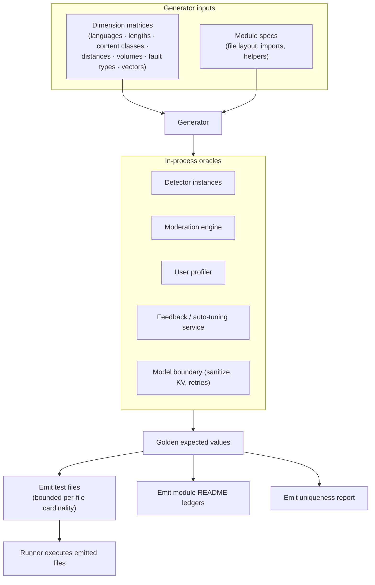

### 8.1 Why an Oracle

For a multilingual moderation stack, expected outcomes are genuinely
computable only by executing the real stack: fuzzy matching across scripts,
package-level positives and negatives, sanitization of control tokens, and
archive arithmetic all depend on the precise installed runtimes. Hand-written
expectations for these would be guesswork. The oracle removes the guess:

- **Detection** outcomes are captured by constructing the real detector over a
  seeded word bank and observing the match flag.
- **Pipeline verdicts** are captured by seeding the real engine with
  dictionary words and thresholds and observing the verdict, suspicion score,
  and pipeline stage.
- **Archive/profiling** totals and ratios are captured by recording through
  the real profiler across a deterministic day sequence and observing summary
  counts and ratios.
- **Deterministic transforms** (sanitization, KV-type mapping, thread
  resolution, typed coercion) are captured by invoking the pure functions and
  freezing exact outputs.

### 8.2 Regeneration Contract

The generator is **idempotent and deterministic**: running it on an unchanged
environment emits byte-identical artifacts. Regeneration is therefore a safe,
recurring operation — it is what keeps the emitted files, the documentation
ledgers, and the uniqueness report in lockstep after any change to a
dimension matrix or a module spec.

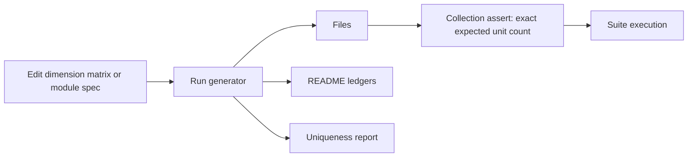

---

## 9. Uniqueness and Anti-Collision Guarantees

Coverage is worthless if it is duplicated. The suite enforces **structural
uniqueness** at two independent layers:

1. **Identifier space.** Each phase allocates identifiers in a disjoint,
   monotonically increasing range that begins strictly after the previous
   phase's ceiling. No two phases can ever collide on an identifier.
2. **Dimension space.** Every emitted case is built from a dimension tuple
   that is distinct from every previously emitted tuple within its module, and
   the generator re-derives matrices to avoid reusing combinations already
   exercised by the hand-written core.

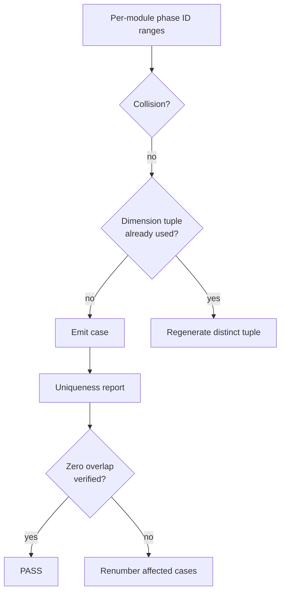

The resulting report is a machine-readable ledger asserting the total number
of emitted cases, the per-module distribution, and the absence of overlap —
so uniqueness is a verified property of every generation run, not a claim in
prose.

---

## 10. Quality Gates

The suite sits behind the same quality bar as production code. Every emitted
file must satisfy the static-analysis gate before it is considered shippable:

| Gate | Tool | Intent |
| :--- | :--- | :--- |
| Lint | ruff (selective rule set) | unused imports, undefined names, shadowing, mutable class defaults |
| Format | ruff formatter | deterministic, opinionated layout across every file |
| Collection | pytest | exact expected unit count, zero collection errors |
| Uniqueness | generator report | zero overlap across phases |
| Typing | full annotations | no untyped public seams in test code |

Because the generator emits imports per module and suppresses only the
rules that are false positives for multilingual fixtures, the emitted files
lint and format cleanly out of the box — a property that is itself
regression-tested.

---

## 11. Lifecycle and CI Pipeline

From change to green, the pipeline is fully defined:

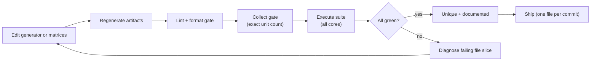

A dedicated serial entry point exists for deterministic CI debugging, while
the default parallel entry point is used for speed in every other context.

---

## 12. Extensibility into Future Phases

The architecture makes growth a **data-entry exercise, not an engineering
effort**. Later phases are modeled as additional rows in the dimension
matrices and additional identifier ranges in the per-module ledgers; nothing
about the runner, the fixtures, the sandbox, or the generation pipeline
changes.

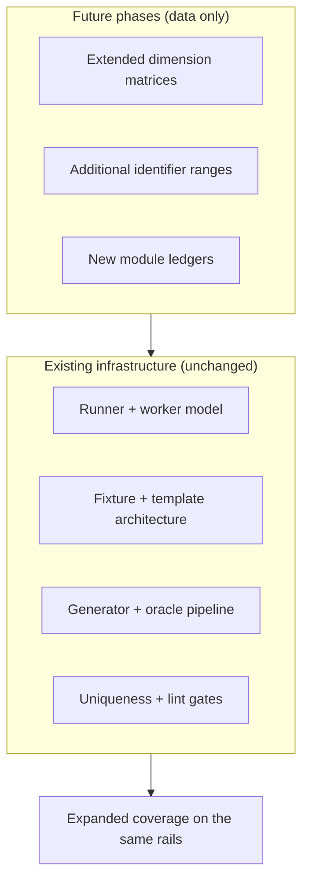

Because every future case is born through the same oracle, isolation, and
uniqueness machinery, the marginal cost of a case approaches zero while the
guarantees remain identical to the first.

---

## 13. Summary

The suite is a deterministic, fully parallel, self-generating test system:

- **Every core, dynamically** — parallelism is derived from the environment,
  never configured by a constant.
- **Every test, isolated** — physical sandboxes and per-test database copies
  behind an immutable session template.
- **Every expectation, observed** — golden values captured from the real
  stack by an in-process oracle.
- **Every case, unique** — disjoint identifier spaces and verified dimension
  uniqueness.
- **Every artifact, machine-checked** — collection asserts, lint gates, and
  uniqueness reports make correctness a property of the pipeline, not of
  intention.

The result is a world-class test platform where depth of coverage and speed
of execution are not traded off against one another — they are both designed
in.

## Related Documentation

- In-repo suite ledgers and matrices live under `backend/tests/` (see each
  module's README).
- [Architecture Overview](../architecture/)
- [Contributing](../contributing)
