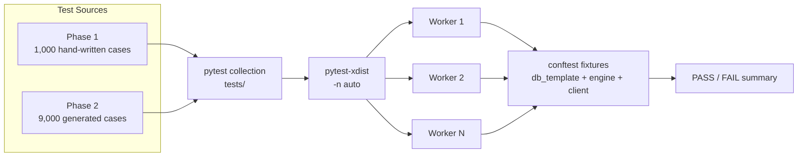
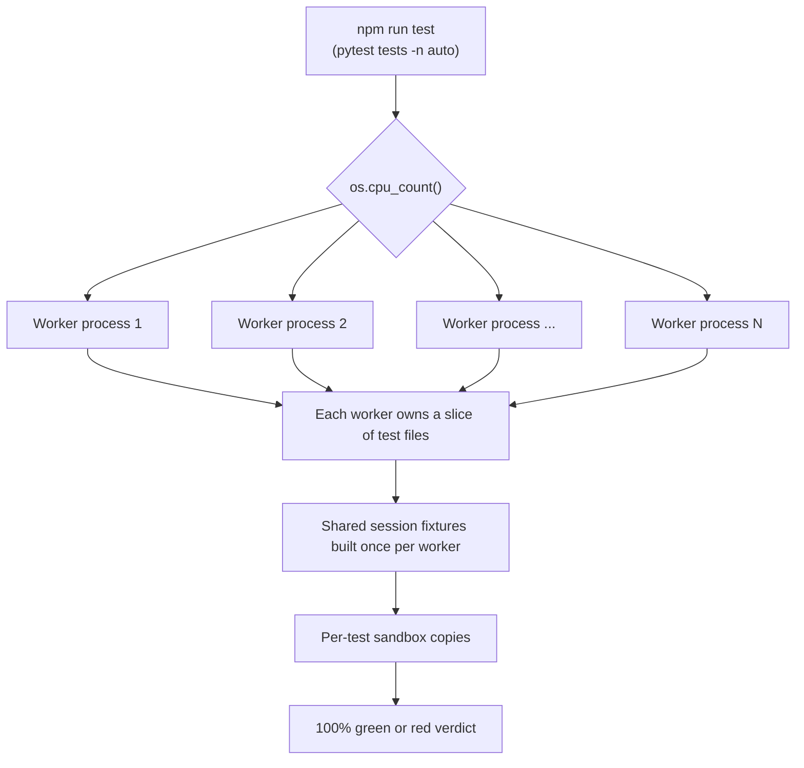
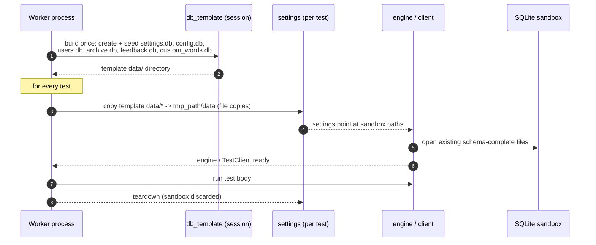
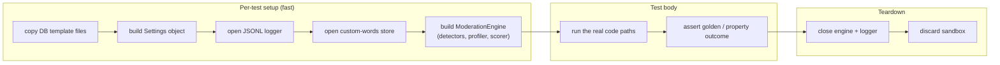
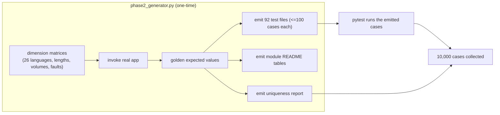
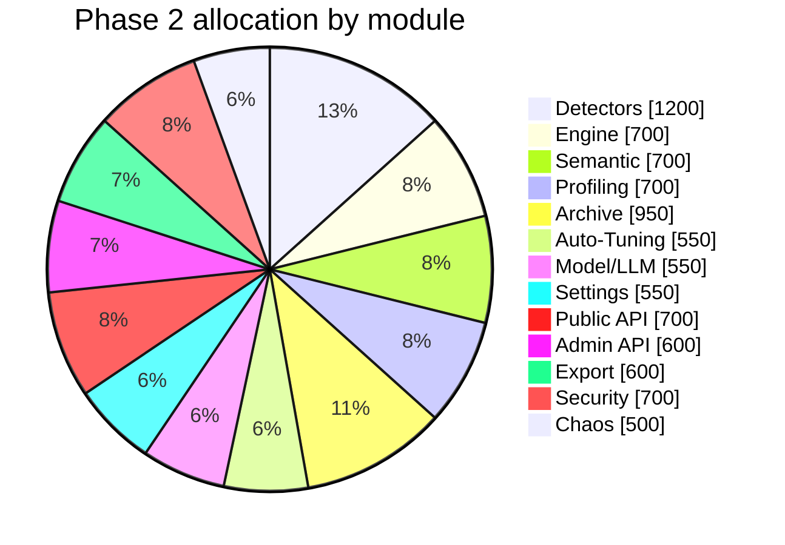
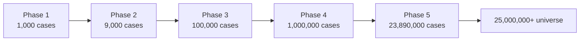

# Testing Pipeline

General Moderation ships a **10,000-test suite** — 1,000 Phase 1 core cases
and 9,000 Phase 2 golden-master cases — that is designed to run as fast as a
modern JS test runner such as Vitest. This page documents the exact pipeline:
how tests are discovered, how the machine's full core count is used, how
fixtures are shared and isolated, and how the Phase 2 suite is generated and
verified.

## Suite Shape

| Property | Value |
| :--- | :--- |
| Total tests | 10,000 |
| Phase 1 | 1,000 hand-written core cases |
| Phase 2 | 9,000 generated golden-master cases |
| Test files | 92 Phase 2 files + 24 Phase 1 files |
| Per-file cap | 100 test cases |
| Runner | pytest + pytest-xdist |
| Isolation | per-test sandbox directory |



## Execution Model: Every Core, No Hard-Coded Worker Count

The suite is invoked with `-n auto`, which asks pytest-xdist to pick the
worker count from the machine's logical CPU count at runtime. There is no
hard-coded `-n 8` or `-n 16` anywhere: on a 4-core laptop it uses 4 workers,
on a 128-core server it uses 128. `test:serial` exists for deterministic
CI debugging but is not the default.



Each worker is a full Python process with its own interpreter, so the
C/C++/Rust detector packages and SQLite engines run truly in parallel across
all cores. Test files are distributed, never duplicated, so there is no
re-execution between workers.

## Fixture Lifecycle: One Seed, Many Sandboxes

The single most expensive operation used to be fixture construction: every
test created and seeded five SQLite databases (settings, app-config, profiler
live, profiler archive, feedback) plus the custom-words store — roughly
100+ ms of schema creation and seeding per test, serialized across the suite.

The `conftest.py` `db_template` fixture fixes this. It is **session-scoped**
per worker: it builds and seeds every database exactly once, then each test's
`settings` fixture **copies** the files into that test's sandbox. Opening an
existing, schema-complete SQLite file costs a fraction of a millisecond versus
creating and seeding it from scratch.



Isolation is unchanged: every test still gets its own physical database
copies, so no test can observe another test's writes. The optimization only
moves schema creation and seeding out of the per-test critical path.

## Per-Test Path



## Phase 2: Golden-Master Generation

The 9,000 Phase 2 cases are emitted by `backend/tests/tools/phase2_generator.py`.
It runs the **real application** at generation time to capture expected values
(a golden master), then writes parametrized pytest files plus every module
README and a uniqueness report. Because generation and execution share the
same locked environment, the emitted assertions reproduce observed behavior
exactly and lock it in as regression coverage.



The uniqueness report (`backend/tests/tools/phase2_uniqueness_report.md`)
proves zero overlap: Phase 2 IDs start after each module's Phase 1 ceiling,
and no dimension combination from Phase 1 is reused.

## Module Allocation

| Module | Phase 1 | Phase 2 | Phase 2 files |
| :--- | :--- | :--- | :--- |
| Detectors | 125 | 1,200 | 12 |
| Engine | 80 | 700 | 7 |
| Semantic | 80 | 700 | 7 |
| User Profiling | 80 | 700 | 7 |
| Archive | 115 | 950 | 10 |
| Auto-Tuning | 60 | 550 | 6 |
| Model/LLM | 60 | 550 | 6 |
| Settings | 60 | 550 | 6 |
| Public API | 80 | 700 | 7 |
| Admin API | 50 | 600 | 6 |
| Export | 70 | 600 | 6 |
| Security | 80 | 700 | 7 |
| Chaos/Resilience | 60 | 500 | 5 |
| **Total** | **1,000** | **9,000** | **92** |



## The 25M Universe

The per-module READMEs document the full planned universe of 25,000,000+
cases. Each phase extends the dimension matrices; the tooling and fixture
design above are built so later phases only add rows to the generator or the
matrices, never new infrastructure.



## Running the Pipeline

```bash
# Everything, using all available cores (worker count = logical CPU count)
npm run test

# Scoped runs (all also use -n auto)
npm run test:unit          # tests/unit
npm run test:integration   # tests/integration
npm run test:e2e           # tests/e2e
npm run test:phase2        # all *_phase2_* files

# Deterministic serial run (CI debugging)
npm run test:serial

# Regenerate the Phase 2 suite, READMEs, and uniqueness report
cd backend && uv run python tests/tools/phase2_generator.py

# Lint and format the suite
cd backend && uv run python -m ruff check tests
cd backend && uv run python -m ruff format --check tests
```

## Adding New Tests

1. Read the module README under `backend/tests/` for the dimension matrix and
   the phase it belongs to.
2. For Phase 2+: add rows to `backend/tests/tools/phase2_generator.py` and
   regenerate (the generator emits files, READMEs, and the uniqueness report).
3. For hand-written cases: follow the Phase 1 pattern (`BaseTest`, frozen
   clock, `conftest` fixtures) and add the case to a file with at most 100
   cases.
4. Update the relevant READMEs.
5. Commit one file per commit with `[TEST-<TYPE>]` tags.

## Related Documentation

- The in-repo test suite docs live under `backend/tests/README.md` and each
  module's `backend/tests/*/README.md`.
- [Architecture Overview](../architecture/)
- [Contributing](../contributing)
